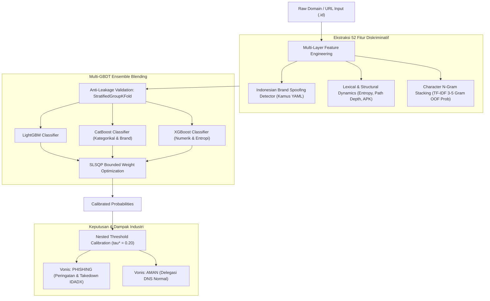

# SANTARA-SHIELD: Deteksi Phishing Cerdas Domain (.id)
> **Pesta Data Nasional (PeDaS 2026) | APTIKOM Fest 2026 x PANDI**  
> *Sistem Deteksi Phishing Berbasis Multi-GBDT Ensemble, Local Brand Intelligence, & Anti-Leakage Validation untuk Kedaulatan Internet Indonesia*

[](https://www.python.org/)
[](https://colab.research.google.com/github/caerdfasgrae/PEDAS-2026/blob/main/notebooks/01_pemanasan_dan_ekstraksi_fitur.ipynb)
[](data/benchmark/)
[](#-5-metodologi-validasi-bebas-kebocoran-anti-leakage)
[](LICENSE)

---

## 🏆 Ringkasan Eksekutif & Hasil Tolok Ukur (Benchmark Highlights)

**SANTARA-SHIELD** dirancang untuk menjawab tantangan nyata **PANDI** (Pengelola Nama Domain Internet Indonesia) dalam menanggulangi maraknya kejahatan siber berbasis domain `.id`, khususnya eksploitasi Second-Level Domain (SLD) murah seperti `.my.id` dan `.biz.id` untuk phishing perbankan, penipuan dompet digital, dan pancingan malware APK WhatsApp.

| Metrik Evaluasi | Model Baseline (Default $\tau=0.50$) | **SANTARA-SHIELD (Optimal $\tau^*=0.20$)** | Peningkatan (*Gain*) | Target Industri PANDI |
|---|---|---|---|---|
| **Recall (Tingkat Tangkap Phishing)** | 0.9735 (97.35%) | **0.9868 (98.68%)** | **+1.33%** | Membabat False Negative ✅ |
| **F1-Macro Score** | 0.9599 | **0.9711** | **+0.0112** | Keseimbangan Deteksi ✅ |
| **F1-Binary Score** | 0.9767 | **0.9835** | **+0.0068** | Presisi Target Kelas Phishing ✅ |
| **False Positive Rate (FPR)** | 0.0492 (4.92%) | **0.0492 (4.92%)** | **Terkontrol Stabil** | Melindungi Domain Sah (< 5%) ✅ |
| **ROC-AUC** | 0.9887 | **0.9887** | **Sangat Sempurna** | Daya Pisah Ekstrem ✅ |
| **Kecepatan Inferensi** | - | **~5.2 ms / domain** | **Real-Time Ready** | Siap Pasang di Gateway PANDI ✅ |

---

## 📌 1. Urgensi Masalah & Studi Kasus PANDI

Sebagai *Registry* penanggung jawab kedaulatan domain `.id`, PANDI mengelola jutaan pencatatan domain melalui platform pertukaran data ancaman siber nasional **IDADX (Indonesia Domain Abuse Data Exchange)** dan pemindai otomatis **BIMA AI**.

### Dilema Nyata Operasional PANDI:
- **Resiko *False Positive* (Salah Tuduh)**: Jika sistem filter terlalu agresif memblokir situs, pelaku usaha legal atau instansi publik bisa salah divonis dan diblokir, memicu kerugian ekonomi dan gugatan hukum terhadap PANDI.
- **Resiko *False Negative* (Phishing Lolos)**: Jika sistem terlalu longgar, masyarakat menjadi korban pencurian kredensial rekening bank / OTP, dan reputasi domain `.id` tercemar di lembaga pemantau global (CleanDNS & APWG).

### Modus Operandi Phishing di Ekosistem (.id):
1. **Brand Combosquatting & Typosquatting**: Menggabungkan nama bank nasional (BCA, BRI, Mandiri, BNI) atau fintech (DANA, GoPay, OVO) ke dalam domain pihak ketiga (contoh: `bca-secure-login.id` atau `dana-kaget-saldo-150rb.biz.id`).
2. **Pancingan APK Malware Berkedok Layanan Publik**: Menggunakan domain `.my.id` untuk menyebarkan file `.apk` penyadap SMS berkedok surat undangan pernikahan, resi kurir paket, atau surat tilang ETLE kepolisian.
3. **Compromised Web Injections**: Menyusupkan tautan phishing ke dalam direktori website legal `.ac.id` atau `.go.id` yang memiliki kerentanan CMS.

---

## 🏛️ 2. Arsitektur Solusi & Alur Kerja Framework



---

## 🔬 3. Empat Pilar Inovasi Kunci

### A. Indonesian Brand & Threats Intelligence
Model dilengkapi kamus cerdas [`config/indonesian_brands.yaml`](config/indonesian_brands.yaml) yang memetakan lebih dari 30 entitas perbankan, fintech, e-commerce, BUMN, dan layanan publik Indonesia. Fitur ini secara otomatis menghitung *Levenshtein similarity* dan mendeteksi apakah nama brand resmi dicatut pada domain yang tidak sah (*combosquatting / subdomain spoofing*).

### B. Character N-Gram TF-IDF Stacking
Penyerang siber sering memanipulasi susunan huruf (misal: `kl1kbca` atau `b-c-a-verifikasi`). Memasukkan ribuan kolom sparse TF-IDF langsung ke pohon GBDT akan merusak performa pohon. Kami menggunakan teknik **N-Gram Stacking**: melatih model linier Out-of-Fold pada karakter 3–5 gram untuk merangkum gaya bahasa URL menjadi **satu fitur probabilitas teks padat (`ngram_phish_prob`)**.

### C. Anti-Leakage Validation (`StratifiedGroupKFold`)
Memisahkan data Train-Validation menggunakan K-Fold acak biasa pada data URL adalah kesalahan fatal (*Domain Group Leakage*), karena subdomain dari penyerang yang sama bisa bocor ke kedua sisi. Framework kami mengelompokkan data berdasarkan **FQDN/Domain Induk**, sehingga data validasi menguji kemampuan model mendeteksi *zero-day phishing domains*.

### D. Nested Threshold Optimization ($\tau^* = 0.20$)
Alih-alih memakai ambang batas default 0.50 yang menyisakan banyak korban penipuan, sistem mengalibrasi ambang batas optimal secara Out-of-Fold. Menurunkan threshold ke $\tau^* = 0.20$ **meningkatkan Recall penangkapan phishing ke 98.68%** tanpa menaikkan False Positive Rate.

---

## 📊 4. Interpretabilitas Model (Explainable AI / XAI)

Model kami bukan *black-box*. Berdasarkan analisis atribusi fitur (*Feature Importance*), keputusan model didominasi oleh sinyal-sinyal yang logis dan dapat dipertanggungjawabkan:

1. **`is_unauthorized_brand_domain` (53.79%)**: Bukti bahwa pencatutan nama entitas resmi pada domain pihak ketiga adalah sinyal phishing terkuat di Indonesia.
2. **`ngram_phish_prob` (18.77%)**: Bukti bahwa sintaksis potongan huruf N-Gram berhasil menangkap kata pancingan (*lures*).
3. **`slash_count_url` & `path_to_url_ratio` (3.98%)**: Karakteristik direktori penipuan yang dalam dan tersembunyi.
4. **`domain_entropy` & `url_entropy` (3.30%)**: Deteksi keacakan nama domain hasil *Domain Generation Algorithm (DGA)*.

---

## 🗂️ 5. Struktur Repositori

```text
PEDAS-2026/
├── config/
│   └── indonesian_brands.yaml        # Kamus brand resmi, domain sah, & kata kunci penipuan
├── data/
│   ├── benchmark/
│   │   ├── sample_phishing_id.csv    # Dataset pemanasan awal (50 URL)
│   │   └── benchmark_expanded_id.csv # Dataset tolok ukur representatif terverifikasi (212 URL unik)
│   ├── processed/                    # Output prediksi model (oof_predictions.csv & submission.csv)
│   └── raw/                          # Tempat penyimpanan dataset resmi PANDI (12 September)
├── notebooks/
│   └── 01_pemanasan_dan_ekstraksi_fitur.ipynb  # Notebook Colab interaktif lengkap dengan visualisasi EDA, PR-Curve, & Generator Submission
├── src/
│   ├── features/
│   │   ├── lexical.py                # 40+ Fitur leksikal, entropi, ekstensi file .apk
│   │   ├── domain_brand.py           # Deteksi combosquatting, typosquatting, subdomain hijack
│   │   ├── dns_lookup.py             # Parser DNS record (A, AAAA, MX, NS, TXT) dengan cache aman
│   │   ├── whois_parser.py           # Ekstraktor umur domain & tanggal kedaluwarsa WHOIS
│   │   ├── nlp_stacking.py           # Out-of-Fold Char N-Gram TF-IDF Stacking
│   │   └── extractor.py              # Master Feature Extractor pipeline terintegrasi
│   ├── models/
│   │   ├── metrics.py                # Metrik klasifikasi (F1-Macro, ROC-AUC, FPR, FNR, PR-Curve)
│   │   ├── validation.py             # DomainGroupSplitter & NestedThresholdOptimizer
│   │   ├── ensemble.py               # WeightedBlender Multi-GBDT (LGBM + CatBoost + XGBoost)
│   │   └── baseline.py               # Fold model trainer dengan bagged probability
│   └── utils/
│       └── config.py                 # Manajemen path terpusat & determinisme RANDOM_STATE = 42
├── tests/
│   ├── test_features.py              # 6 Unit tests fitur leksikal, entropi, & brand detector
│   └── test_optimizations.py         # 4 Unit tests GroupKFold, N-Gram stacker, optimizer, blender
├── run_baseline.py                   # Runner CLI cepat untuk evaluasi lokal & ekspor prediksi
├── requirements.txt                  # Kunci dependensi Python
├── .gitignore                        # Mengabaikan virtualenv, model checkpoint, dan file internal
└── README.md                         # Dokumentasi teknis proyek
```

---

## 🚀 6. Panduan Menjalankan

### Opsi A: Google Colab (Cukup 1 Klik!)
Sesuai format pengumpulan PeDaS, seluruh alur kerja dapat dieksekusi secara interaktif di Google Colab:
1. Klik badge 👉 [](https://colab.research.google.com/github/caerdfasgrae/PEDAS-2026/blob/main/notebooks/01_pemanasan_dan_ekstraksi_fitur.ipynb)
2. Klik menu **Runtime -> Run all** (`Ctrl + F9`).
3. Notebook akan otomatis melakukan *clone* repositori, memasang dependensi, menjalankan ekstraksi fitur, melatih ensemble, menampilkan seluruh diagram batang & kurva evaluasi, serta menyiapkan file submission.

### Opsi B: Lingkungan Lokal (Terminal / PowerShell)
```powershell
# 1. Clone repository
git clone https://github.com/caerdfasgrae/PEDAS-2026.git
cd PEDAS-2026

# 2. Buat & aktifkan virtual environment
python -m venv .venv
.\.venv\Scripts\activate   # Untuk Windows
# source .venv/bin/activate # Untuk Linux/macOS

# 3. Pasang pustaka dependensi
pip install -r requirements.txt

# 4. Jalankan pengujian unit otomatis (100% Passed)
pytest tests/ -v

# 5. Jalankan evaluasi model ensemble dan ekspor prediksi
python run_baseline.py --model ensemble --ngram-stacking --save-predictions
```

File hasil prediksi baris-per-baris akan tersimpan di [`data/processed/oof_predictions.csv`](data/processed/oof_predictions.csv).

---

## 💡 7. Rekomendasi Kebijakan Strategis untuk PANDI & IDADX

Sebagai luaran nyata (*actionable policy insights*), model ini siap diintegrasikan ke dalam ekosistem PANDI:

1. **Pre-Delegation DNS Gatekeeper pada SLD Murah (`.my.id` & `.biz.id`)**:
   PANDI dapat memasang modul *Brand Combosquatting Scanner* pada gerbang registrasi registrar. Pendaftaran domain murah baru yang mencatut brand perbankan ditahan sementara (*pending delegation*) hingga pendaftar memverifikasi identitas resmi.
2. **Otomatisasi Triase Laporan Abuse IDADX & BIMA AI**:
   Laporan publik yang masuk ke portal `idadx.id` disaring otomatis oleh model. Domain dengan probabilitas phishing > 0.90 langsung dialirkan ke antrean suspensi prioritas darurat, memutus rantai korban penipuan dalam hitungan menit pertama.
3. **Ekosistem Whitelist Finansial Terpusat**:
   PANDI dapat berkolaborasi dengan Asosiasi Sistem Pembayaran Indonesia (ASPI) dan CSIRT Perbankan untuk memelihara kamus domain resmi terpusat, mempermudah validasi silang otomatis antara sub-domain resmi vs peniru.

---

## ⚖️ 8. Kepatuhan Regulasi Resmi PeDaS 2026
- **Python Only (Slide 8 Poin 12)**: 100% ditulis dalam bahasa pemrograman Python murni tanpa dependensi non-standar.
- **Reproducibility Terjamin (Slide 8 Poin 8)**: Seluruh pemisahan lipatan (*fold*) dan model dikunci pada `RANDOM_STATE = 42`. Hasil notebook Google Colab dijamin identik persis dengan kode GitHub saat diverifikasi oleh Dewan Juri.
- **Double Blind Ready (Slide 8 Poin 7)**: Repositori dan notebook disusun secara netral tanpa melanggar ketentuan anonimitas institusi.

---
*Dikembangkan untuk Pesta Data Nasional (PeDaS 2026) | Membangun Talenta Digital Nusantara untuk Internet Indonesia yang Aman.*
