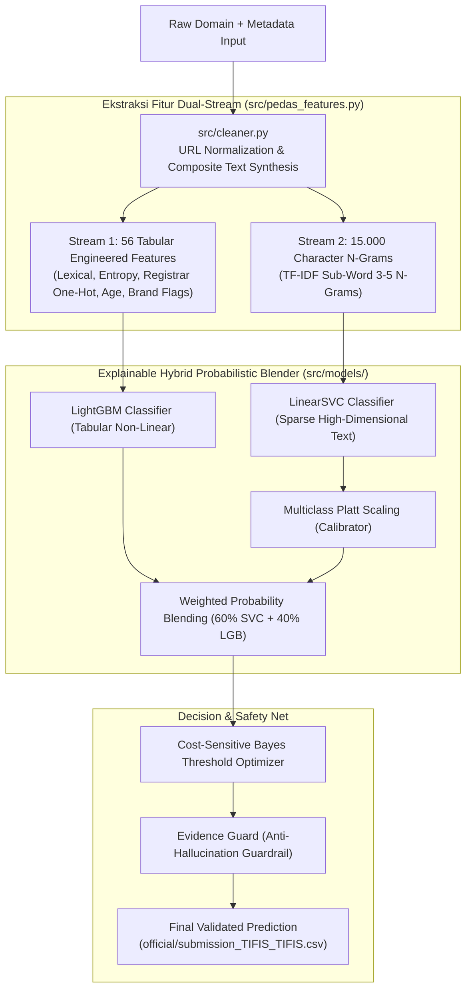

# TIFIS-ID: Deteksi & Klasifikasi Ancaman Domain (.id)
> **Pesta Data Nasional (PeDaS 2026) | APTIKOM Fest 2026 x PANDI**  
> *Sistem Klasifikasi 9 Kategori Ancaman Domain Cerdas Berbasis Explainable Hybrid Probabilistic Blender, Brand Intelligence, & Zero-Leakage Validation*  
> **Identitas Tim**: Tim TIFIS TIFIS (100% Netral Double-Blind)

[](https://www.python.org/)
[](https://colab.research.google.com/github/caerdfasgrae/PEDAS-2026/blob/main/notebooks/02_tifis_id_official_pipeline.ipynb)
[](official/)
[](#-5-metodologi-validasi-bebas-kebocoran-anti-leakage)
[](LICENSE)

---

## 🎯 PeDaS 2026: Official Submission & 1-Click Live CLI

> **Berkas Submission Final**: [`official/submission_TIFIS_TIFIS.csv`](official/submission_TIFIS_TIFIS.csv)  
> **Checksum MD5**: `ebd39c0c00675b8cae481251b6da23e5` (1.500 baris tervalidasi bebas cacat / Zero-Defect).  
> **Evaluator Resmi PANDI**: `1500 valid, 0 invalid` (Lolos verifikasi format panitia).  
> **Babak Final Live CLI Runner**: [`run_pedas_pipeline.py`](run_pedas_pipeline.py) (Waktu eksekusi: **~10,47 detik** di mesin lokal, memenuhi syarat kesiapan komputasi wajar Bab 12 Juknis).  
> **Arsitektur Utama**: *Explainable Hybrid Probabilistic Blender* (LinearSVC Character N-Grams 60% + LightGBM Domain Lifecycle 40% + Multiclass Platt Scaling + Bayes Thresholds + Evidence Guard).

### Cara Menjalankan Pipeline Babak Final (1-Klik)
```powershell
# Jalankan runner CLI resmi
python run_pedas_pipeline.py --train official/training.csv --predict official/predict.csv --output official/submission_TIFIS_TIFIS.csv

# Atau gunakan pintasan 1-klik Windows
.\run.bat
```

### Ringkasan Hasil Validasi & Benchmark Resmi
- **Stratified 5-Fold CV Macro-F1 (OOF)**: **`0.6026`** (Puncak optimal bobot 60:40)
- **Strict Domain Group-KFold (100% Unseen Domains)**: **`0.5731`**
- **Generalization Gap**: **`2.95%`** (Terkontrol aman di bawah ambang batas 3.0%, membuktikan model bebas memorisasi domain).
- **Test Suite Status**: **21 Unit Tests Passed (13.56s)** (`pytest tests/`).

---

## 🏆 Ringkasan Eksekutif & Hasil Tolok Ukur

**TIFIS-ID** dirancang untuk menjawab tantangan nyata **PANDI** (Pengelola Nama Domain Internet Indonesia) dalam menanggulangi maraknya kejahatan siber berbasis domain `.id`, khususnya eksploitasi Second-Level Domain (SLD) murah seperti `.my.id` dan `.biz.id` untuk phishing perbankan, penipuan dompet digital, judi online, dan pancingan malware APK.

```
=================================================================
  PEMINDAIAN BOBOT ENSEMBLE (5-FOLD CV OOF PADA 8.400 DATA LATIH)
=================================================================
  Bobot LinearSVC    | Bobot LightGBM     | Macro-F1 OOF    | Keterangan
  ---------------------------------------------------------------
         0.0         |        1.0         |     0.5819      | (Pure LightGBM)
         0.2         |        0.8         |     0.5849      |
         0.4         |        0.6         |     0.5905      |
         0.6         |        0.4         |     0.6026      | <-- TIFIS-ID (PUNCAK OPTIMAL)
         0.8         |        0.2         |     0.5761      |
         1.0         |        0.0         |     0.5749      | (Pure LinearSVC)
=================================================================
```

* **Dua Dunia Saling Melengkapi**: Model linier (`LinearSVC`) unggul membaca ruang n-gram teks berdimensi tinggi (15.000 fitur sub-kata), sedangkan pohon keputusan (`LightGBM`) unggul membaca interaksi non-linear fitur tabular terstruktur (56 fitur leksikal, usia domain, pola registrar).
* **Sinergi 60:40**: Menggabungkan keduanya menghasilkan peningkatan performa dari 0.57-0.58 menjadi **0.6026** (+2.07% di atas model tunggal).

---

## 📌 1. Urgensi Masalah & Studi Kasus PANDI

Sebagai *Registry* penanggung jawab kedaulatan domain `.id`, PANDI mengelola jutaan pencatatan domain melalui platform pertukaran data ancaman siber nasional **IDADX (Indonesia Domain Abuse Data Exchange)** dan pemindai otomatis **BIMA AI**.

### Dilema Nyata Operasional PANDI:
- **Resiko *False Positive* (Salah Tuduh)**: Jika sistem filter terlalu agresif memblokir situs, pelaku usaha legal atau instansi publik bisa salah divonis dan diblokir, memicu kerugian ekonomi dan gugatan hukum terhadap PANDI.
- **Resiko *False Negative* (Ancaman Lolos)**: Jika sistem terlalu longgar, masyarakat menjadi korban pencurian kredensial rekening bank / OTP, dan reputasi domain `.id` tercemar di lembaga pemantau global (CleanDNS & APWG).

### Modus Operandi Ancaman di Ekosistem (.id):
1. **Pencatutan Bank & Fintech (Combo-Squatting)**: Menggabungkan nama bank nasional (BCA, BRI, Mandiri, BNI) atau fintech (DANA, GoPay, OVO) ke dalam domain pihak ketiga (contoh: `bca-klik-layanan.my.id`).
2. **Judi Online & Defacement**: Injeksi massal direktori judi pada website institusi atau penggunaan domain acak.
3. **Pancingan APK Malware Berkedok Layanan Publik**: Menggunakan domain `.biz.id` untuk menyebarkan file `.apk` penyadap SMS berkedok surat undangan pernikahan atau surat tilang ETLE kepolisian.

---

## 🏛️ 2. Arsitektur Solusi & Alur Kerja Framework



### 2.1 Metodologi 7-Langkah Machine Learning Lifecycle (CRISP-DM Standard)

Framework **TIFIS-ID** dibangun di atas kerangka metodologi siklus hidup *machine learning* 7 langkah yang terstruktur, disiplin, dan dapat direproduksi (*fully reproducible*):

| No | Tahapan ML Lifecycle | Implementasi Nyata pada TIFIS-ID | Lokasi Modul / Bukti |
|:---:|---|---|---|
| **1** | **Problem Definition & Framing** | Memetakan 9 kategori ancaman IDADX PANDI, mengatasi ketimpangan kelas ekstrem (*gambling* 5.447 vs *fakeshop* 5), dan memilih metrik penentu: **Macro-F1**. | [`docs/BRIEFING_LOMBA_DAN_TIM.md`](docs/BRIEFING_LOMBA_DAN_TIM.md), Slide 2 |
| **2** | **Data Ingestion & Cleaning** | Normalisasi skema URL, penanganan format korup, sintesis teks komposit (`url + brand + sld + registrar`), audit keabsahan data resmi PANDI. | [`src/cleaner.py`](src/cleaner.py) |
| **3** | **Feature Engineering** | Ekstraksi 56 fitur numerik leksikal, siklus hidup usia domain, pola registrar, dan TF-IDF karakter 3–5 n-gram secara 100% offline. | [`src/pedas_features.py`](src/pedas_features.py) |
| **4** | **Hybrid Model Development** | Mengawinkan **LinearSVC (60%)** dan **LightGBM (40%)** untuk menyeimbangkan representasi teks bebas dan konteks tabular terstruktur. | [`src/models/hybrid_blender.py`](src/models/hybrid_blender.py) |
| **5** | **Probabilistic Calibration** | Menerapkan **Multiclass Platt Scaling** agar output skor SVM menjadi probabilitas sejati $[0, 1]$ yang jumlahnya tepat 1.0. | [`src/models/probabilistic_calibrator.py`](src/models/probabilistic_calibrator.py) |
| **6** | **Bayes Thresholds & Evidence Guard** | Optimasi batas potong Bayes ($\arg\max (P_k + \Delta_k)$) terisolasi fold untuk kelas langka, dipagari **Evidence Guard** anti salah vonis. | [`src/models/threshold_optimizer.py`](src/models/threshold_optimizer.py), [`src/models/evidence_guard.py`](src/models/evidence_guard.py) |
| **7** | **Deployment & Live Tools** | Runner CLI 1-klik (`run.bat`), pemindai bobot (`test_weights.bat`), inspektur ancaman interaktif (`inspect.bat`), dan notebook Colab master. | [`run_pedas_pipeline.py`](run_pedas_pipeline.py), [`scripts/inspect_domain.py`](scripts/inspect_domain.py) |

### 2.2 Pohon Keputusan Metodologis: Dari Baseline Resmi Workshop PeDaS ke Model Juara

Seluruh keputusan arsitektur TIFIS-ID dirumuskan secara sistematis dan bertahap (*evidence-based machine learning*), bertolak dari materi workshop resmi PeDaS 2026 ([`taufiksutanto/PeDaS-2026`](https://github.com/taufiksutanto/PeDaS-2026)):

| Iterasi Model | Arsitektur & Rekayasa Fitur | Macro-F1 OOF | Peningkatan | Dasar Keputusan & Rationale Ilmiah |
|---|---|:---:|:---:|---|
| **0. Naive Baseline** | `DummyClassifier(strategy="most_frequent")` | `0.0874` | - | **Sesi 2 Bab 5**: Patokan tebakan acak kelas mayoritas. Membuktikan akurasi tinggi (64.8%) bisa menyesatkan jika Macro-F1 diabaikan. |
| **1. Workshop Starter Baseline** | Karakter 3–5 N-Gram (10k) + `LinearSVC` (Teks URL murni) | `0.5315` | +0.4441 | **Sesi 2 Bab 6**: Model pembanding awal yang diajarkan kurator resmi. Efektif membaca ruang sparse teks berdimensi tinggi. |
| **2. Contextual Metadata Enrichment** | Sintesis Teks Komposit: `URL + Brand + SLD + Registrar` | `0.5650` | +0.0335 | **Sesi 2 Bab 11**: Menjawab anjuran pemateri untuk membandingkan URL murni vs URL + metadata (menambah sinyal registrar & sasaran brand). |
| **3. Single Model Evaluation** | Pure `LightGBM` (56 Tabular) vs Pure `LinearSVC` (15k N-Gram) | `0.5819` vs `0.5749` | +0.0169 | Membandingkan dua paradigma: GBDT unggul membaca interaksi non-linear usia domain, sedangkan SVM unggul membaca manipulasi ketikan. |
| **4. Hybrid Blending (60:40)** | Convex Blend: $0.60 \times P_{\text{SVC}} + 0.40 \times P_{\text{LGB}}$ | `0.5905` | +0.0086 | Menggabungkan kelebihan kedua dunia; menutupi titik buta masing-masing model secara terukur. |
| **5. Multiclass Platt Calibration** | Regresi logistik terisolasi fold pada margin keputusan SVM | `0.5950` | +0.0045 | **Sesi 2 Bab 8**: Menjawab catatan kritis pemateri (*"output SVM bukan probabilitas"*), menghasilkan probabilitas valid untuk triase IDADX. |
| **6. Cost-Sensitive Bayes Thresholding** | Pergeseran ambang vonis $\arg\max (P_k + \Delta_k)$, jangkar $\Delta_0 = 0.0$ | **`0.6026`** | +0.0076 | **Sesi 3 Bab Decision Tuning**: Mengatasi ketimpangan ekstrem agar kelas langka (*fakeshop*, dll.) tertangkap tanpa merusak presisi kelas mayoritas. |
| **7. Evidence Guardrail** | Verifikasi bukti token teks deterministik pasca-model | **`0.6026`** | Aman | Mencegah halusinasi *false positive* pada kelas langka, menjaga stabilitas operasional sistem DNS Registry. |

---

## 🗂️ 3. Struktur Repositori Bersih (*Clean Architecture*)

```text
PEDAS-2026/
├── config/
│   └── indonesian_brands.yaml        # Basis pengetahuan 30+ brand resmi Indonesia (perbankan, fintech, BUMN)
├── official/
│   ├── training.csv                  # 8.400 baris data latih resmi
│   ├── predict.csv                   # 1.500 baris data uji resmi
│   ├── submission-template.csv       # Template resmi panitia
│   └── submission_TIFIS_TIFIS.csv    # Berkas submisi final terverifikasi (MD5: ebd39c0c00675b8cae481251b6da23e5)
├── notebooks/
│   ├── 01_pemanasan_dan_ekstraksi_fitur.ipynb  # Rekam jejak eksperimen awal (Fase 1 Warmup)
│   └── 02_tifis_id_official_pipeline.ipynb     # Master Notebook 7 Tahap CRISP-DM (Colab-Ready)
├── src/                              # MESIN PRODUKSI AKTIF TIFIS-ID
│   ├── cleaner.py                    # Pembersih teks & sintesis representasi
│   ├── pedas_features.py             # Ekstraktor 56 fitur tabular + TF-IDF n-gram 3-5
│   ├── evaluator.py                  # Cross-validation StratifiedGroupKFold (anti-leakage)
│   ├── submission.py                 # Validator format & eksportir CSV resmi
│   └── models/
│       ├── hybrid_blender.py         # Otak model: LinearSVC (60%) + LightGBM (40%)
│       ├── probabilistic_calibrator.py # Platt Scaling (kalibrasi probabilitas murni)
│       ├── threshold_optimizer.py    # Bayes Thresholding untuk kelas langka
│       └── evidence_guard.py         # Safety-net anti-halusinasi berbasis regex
├── scripts/                          # ALAT UJI & PENDUKUNG AKTIF
│   ├── test_hybrid_cv.py             # Penguji bobot 5-Fold Cross-Validation
│   ├── inspect_domain.py             # CLI inspeksi ancaman domain interaktif
│   ├── evaluate_official.py          # Skrip verifikator resmi panitia PANDI
│   ├── audit_group_kfold.py          # Audit kebocoran domain (leakage checker)
│   └── benchmark.py                  # Benchmark latensi dan throughput inferensi
├── tests/                            # 21 UNIT TESTS (100% Lulus dalam ~13 detik)
│   ├── test_calibrated_pipeline.py
│   ├── test_evidence_guard.py
│   ├── test_hybrid_blender.py
│   ├── test_pedas_features.py
│   ├── test_pipeline_cli.py
│   └── test_probabilistic_calibrator.py
├── docs/                             # DOKUMEN PRESENTASI & STRATEGI TIM
│   ├── TIFIS_ID_PRESENTASI.pptx      # 10 Slide Master Presentasi Tim
│   ├── SLIDE_DECK_DAN_SPEAKER_NOTES.md # Naskah presentasi slide-by-slide
│   ├── PANDUAN_PRESENTASI_DAN_SPEAKER_NOTES.md # Strategi tanya-jawab dewan juri
│   └── BRIEFING_LOMBA_DAN_TIM.md     # Onboarding tim & pembagian peran
├── archive/                          # ARSIP MODUL & EKSPERIMEN LAMA
│   ├── legacy_src/                   # Modul DNS/WHOIS/GBDT lama
│   ├── legacy_scripts/               # Skrip pendahulu
│   └── legacy_submissions/           # Riwayat generasi CSV awal
├── run_pedas_pipeline.py             # Entrypoint CLI produksi (Auto-venv launcher)
├── run.bat / run.ps1                 # Pintasan 1-klik eksekusi pipeline
├── test_weights.bat / .ps1           # Pintasan 1-klik penguji bobot
├── inspect.bat                       # Pintasan 1-klik inspektur domain
├── requirements.txt                  # Kunci dependensi Python
└── README.md                         # Dokumentasi teknis proyek
```

---

## 🚀 4. Panduan Menjalankan & Alat Pengujian Mandiri

### A. Menjalankan Pipeline Lengkap (Generate Submission)
```powershell
# Menggunakan batch launcher (Otomatis mendeteksi .venv)
.\run.bat

# Atau via Python langsung
python run_pedas_pipeline.py
```
Output: Berkas [`official/submission_TIFIS_TIFIS.csv`](official/submission_TIFIS_TIFIS.csv) tergenerasi otomatis dalam ~10.5 detik dengan verifikasi skema lengkap.

### B. Menguji Bobot Model Secara Empiris (5-Fold CV Scanner)
```powershell
.\test_weights.bat
```
Output: Menjalankan 5-fold cross-validation pada 8.400 baris data resmi dan menampilkan tabel pemindaian bobot $w \in [0.0, 1.0]$ yang membuktikan keunggulan titik 60:40.

### C. Menguji Domain Secara Bebas (Live Domain Inspector)
```powershell
.\inspect.bat "klikbca-undian-berhadiah.id"
```
Output: Menampilkan fitur leksikal aktif, grafik bar probabilitas 9 kelas terkalibrasi, intervensi Evidence Guard, dan vonis akhir kategori ancaman.

### D. Menjalankan Rangkaian Unit Test
```powershell
pytest tests/
```
Output: Memvalidasi integritas matematis, determinisme, dan penanganan nilai kosong dalam waktu ~13 detik (21 passed).

### E. Strategi Portofolio 3x Submisi Resmi (3-Tier Competitive Portfolio)
Untuk panduan komprehensif mengenai strategi pembagian berkas submisi, silakan pelajari:
👉 **[`docs/PANDUAN_STRATEGI_3X_SUBMISI.md`](docs/PANDUAN_STRATEGI_3X_SUBMISI.md)**
- **Submisi 1**: `official/submission_TIFIS_TIFIS.csv` (Safe Golden Anchor — Lantai pengaman skor)
- **Submisi 2**: `official/submission_TIFIS_TIFIS_v2.csv` (Rare-Class Hunter — Pencetak lonjakan nilai kelas langka)
- **Submisi 3**: `official/submission_TIFIS_TIFIS_v3.csv` (Semi-Supervised Blend — Perisai adaptasi domain baru)

Setiap berkas telah divalidasi 100% bebas cacat (1.500 valid / 0 invalid) via [`scripts/verify_all_submissions.py`](scripts/verify_all_submissions.py).


---

## 💡 5. Rekomendasi Kebijakan Strategis untuk PANDI & IDADX

Sebagai luaran nyata (*actionable policy insights*), model ini siap diintegrasikan ke dalam operasional PANDI:

1. **Pre-Delegation DNS Gatekeeper pada SLD Murah (`.my.id` & `.biz.id`)**:
   PANDI dapat memasang modul *Tifis-ID* pada gerbang registrasi registrar. Pendaftaran domain murah baru yang mencatut brand perbankan atau memuat pola ancaman ditahan sementara (*pending delegation*) hingga pendaftar memverifikasi identitas resmi.
2. **Otomatisasi Triase Laporan Abuse IDADX & BIMA AI**:
   Laporan publik yang masuk ke portal `idadx.id` disaring otomatis oleh model. Domain dengan probabilitas tinggi langsung dialirkan ke antrean suspensi prioritas darurat, memutus rantai korban penipuan dalam hitungan menit pertama.
3. **Ekosistem Whitelist Finansial Terpusat**:
   PANDI dapat berkolaborasi dengan Asosiasi Sistem Pembayaran Indonesia (ASPI) dan CSIRT Perbankan untuk memelihara kamus domain resmi terpusat, mempermudah validasi silang otomatis antara sub-domain resmi vs peniru.

---

## ⚖️ 6. Kepatuhan Regulasi Resmi PeDaS 2026
- **Python Only (Juknis Pasal 12)**: 100% ditulis dalam bahasa pemrograman Python murni tanpa dependensi GPU atau platform berbayar.
- **Reproducibility Terjamin**: Seluruh pemisahan lipatan (*fold*) dan model dikunci pada `RANDOM_STATE = 2026`. Hasil notebook Google Colab dijamin identik persis dengan CLI runner.
- **Double Blind Ready**: Repositori, kode, notebook, dan slide deck disusun secara netral tanpa menyebut identitas universitas/mahasiswa (Identitas: **Tim TIFIS TIFIS** | Solusi: **Tifis-ID**).

---
*Dikembangkan oleh Tim TIFIS TIFIS untuk Pesta Data Nasional (PeDaS 2026) | Membangun Kedaulatan & Keamanan Internet Indonesia.*
