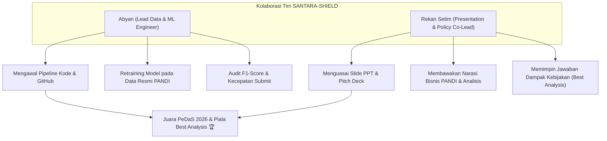

# 🛡️ SANTARA-SHIELD: Dokumen Briefing Lomba & Panduan Tim PeDaS 2026
> **Dokumen Internal Tim**: Panduan Lengkap Memahami Lomba, Strategi Kemenangan, Arsitektur Model, dan Pembagian Tugas.  
> **Kompetisi**: Pesta Data Nasional (PeDaS 2026) | APTIKOM Fest 2026 x PANDI  
> **Kategori**: Deteksi Phishing Domain `.id`  
> **Status**: Rahasia Tim (*Internal Team Briefing*)

---

## 📌 DAFTAR ISI
1. [Mengenal Lomba PeDaS 2026 & Penyelenggara](#1-mengenal-lomba-pedas-2026--penyelenggara)
2. [Latar Belakang Masalah: Mengapa Masalah Ini Sangat Krusial?](#2-latar-belakang-masalah-mengapa-masalah-ini-sangat-krusial)
3. [Format Lomba, Aturan Main, & Kriteria Penilaian](#3-format-lomba-aturan-main--kriteria-penilaian)
4. [Linimasa (Timeline) Krusial Kompetisi](#4-linimasa-timeline-krusial-kompetisi)
5. [Bedah Senjata Tim Kita: SANTARA-SHIELD](#5-bedah-senjata-tim-kita-santara-shield)
6. [Pembagian Peran & Strategi Kolaborasi Tim](#6-pembagian-peran--strategi-kolaborasi-tim)
7. [Glosarium Istilah Keren (Dari Bahasa Awam ke Bahasa Juri)](#7-glosarium-istilah-keren-dari-bahasa-awam-ke-bahasa-juri)
8. [Cara Mencoba & Menjalankan Demo Sistem](#8-cara-mencoba--menjalankan-demo-sistem)

---

## 1. Mengenal Lomba PeDaS 2026 & Penyelenggara

### Siapa Penyelenggaranya?
Kompetisi ini diselenggarakan melalui kolaborasi dua institusi paling berpengaruh di ranah informatika dan internet Indonesia:
1. **APTIKOM (Asosiasi Pendidikan Tinggi Informatika dan Komputer)**: Asosiasi resmi yang menaungi seluruh program studi ilmu komputer dan informatika di seluruh universitas di Indonesia.
2. **PANDI (Pengelola Nama Domain Internet Indonesia)**: Lembaga nirlaba yang ditunjuk oleh Pemerintah Republik Indonesia (Kemenkominfo) sebagai satu-satunya otoritas *Registry* yang mengelola, menerbitkan, dan mengawasi seluruh nama domain berakhiran `.id` (seperti `.id`, `.co.id`, `.my.id`, `.biz.id`, `.web.id`, dll.).

### Apa Tema & Tantangan Utamanya?
Tantangannya adalah: **Membangun Model Kecerdasan Buatan (Machine Learning) untuk Mendeteksi Domain Phishing Berbahaya pada Ekosistem Domain Tingkat Tinggi Indonesia (`.id`)**.

Lomba ini bukan sekadar tugas kuliah biasa, melainkan sayembara nasional untuk mencari solusi nyata bagi perlindungan ruang siber Indonesia dari kejahatan penipuan online.

---

## 2. Latar Belakang Masalah: Mengapa Masalah Ini Sangat Krusial?

### A. Fenomena Penipuan Domain Murah di Indonesia
Pelaku kejahatan siber saat ini semakin licik. Mereka memanfaatkan domain lokal berbiaya murah yang tidak memerlukan syarat verifikasi KTP/dokumen bisnis ketat, khususnya:
* **`.my.id`** (Harganya sangat murah, sering promo Rp10.000–Rp15.000/tahun).
* **`.biz.id`** (Sering digunakan menyamar sebagai entitas bisnis).

### B. Modus Operandi Nyata yang Sering Menjerat Korban
1. **Pencatutan Bank & Fintech (Combo-Squatting)**:
   - Contoh: `bca-klik-layanan-bebas-biaya.my.id`, `verifikasi-dana-saldo.biz.id`.
   - Korban diarahkan ke halaman login tiruan persis aslinya untuk menguras saldo tabungan.
2. **Modus APK Malware WhatsApp**:
   - Contoh: `surat-tilang-etle-polri.biz.id/unduh-surat.apk`, `undangan-pernikahan.my.id/surat.apk`, `resi-paket-jne-tracking.biz.id/lacak.apk`.
   - Korban diminta mengunduh berkas `.apk` yang diam-diam menyadap SMS OTP m-Banking.

### C. Celah Operasional Sistem PANDI Saat Ini
PANDI saat ini memiliki dua sistem utama:
1. **IDADX (Indonesia Anti-Phishing Data Exchange)**: Portal tempat bank dan masyarakat melaporkan situs penipuan. Kelemahannya: **Reaktif**. Situs baru ditindak setelah ada korban melapor (biasanya setelah 24 jam penipuan berjalan).
2. **BIMA AI**: Sistem kecerdasan buatan PANDI yang melakukan perayapan (*deep crawling*) konten web. Kelemahannya: Butuh waktu lama untuk merayapi jutaan domain aktif secara berkala.

### D. Di Mana Posisi Solusi Kita (SANTARA-SHIELD)?
Model kita mengisi celah tersebut dengan bertindak sebagai **"Radar Gerbang Pendaftaran" (Pre-Delegation & First-Line Triage Gatekeeper)**:
* Begitu ada orang mendaftarkan nama domain baru di Registrar, sistem kita menganalisis struktur URL dan potensi pencatutan brand dalam waktu **kurang dari 1 milidetik** secara *offline*.
* Domain berbahaya langsung ditahan (*pending delegation*) atau disodorkan ke meja analis manusia PANDI **sebelum domain tersebut sempat online dan memakan korban!**

---

## 3. Format Lomba, Aturan Main, & Kriteria Penilaian

### ⚠️ Aturan Paling Kritis: DOUBLE-BLIND REVIEW!
Dewan juri menerapkan sistem peninjauan buta ganda (*double-blind review*):
* **DILARANG KERAS** mencantumkan:
  - Nama anggota tim
  - Nama universitas / perguruan tinggi
  - Logo kampus / instansi
  pada notebook Google Colab, video pitching, slide presentasi, maupun file repositori.
* **Gunakan hanya Nama Tim dan Nama Solusi kita**: **SANTARA-SHIELD**.
* Pelanggaran aturan identitas ini akan berujung pada diskualifikasi langsung!

### Tahapan Penilaian:

#### 1. Babak Penyisihan (14–25 September 2026)
* Panitia akan membagikan berkas `test.csv` (berisi daftar ribuan URL `.id` tanpa label jawaban).
* Peserta mengunggah notebook Google Colab, link GitHub, dan file hasil prediksi (`submission.csv`).
* **Kriteria Penentu Kelolosan**:
  1. Skor evaluasi model (**F1-Score / Recall**).
  2. **Kecepatan Waktu Submit**: Peserta yang submit lebih awal dengan skor tinggi memiliki keunggulan kompetitif di *leaderboard*.

#### 2. Babak Final (3 Oktober 2026)
* Peserta yang lolos mempresentasikan solusi di hadapan Dewan Juri (Pakar PANDI dan Guru Besar/Dosen APTIKOM).
* Durasi presentasi: **7–10 menit** dilanjutkan dengan tanya jawab sinkronus.
* **Kategori Penghargaan Bergengsi**:
  - Juara 1, 2, 3 PeDaS 2026.
  - **Piala Best Analysis**: Diberikan kepada tim yang analisis datanya paling komprehensif, metodologinya paling kuat, dan memberikan rekomendasi kebijakan nyata bagi industri PANDI. *(Ini adalah target utama kita!)*

---

## 4. Linimasa (Timeline) Krusial Kompetisi

| Tanggal | Agenda & Tindakan Tim |
|---|---|
| **12–13 September 2026** | **Rilis Data Resmi PANDI & Technical Webinar**. Panitia membagikan dataset pelatihan resmi (`train.csv`) dan data uji (`test.csv`). |
| **14–25 September 2026** | **Babak Penyisihan (Sprint Submission)**. Kita memuat data resmi ke pipeline, melatih model, memeriksa skor F1, dan langsung men-submit ke panitia secepat mungkin! |
| **27 September 2026** | **Pengumuman Finalis**. Pengumuman tim yang lolos ke Babak Final. |
| **28 Sept – 2 Okt 2026** | **Persiapan Pitch Deck & Gladi Bersih**. Merapikan slide presentasi, merekam video (jika diminta), dan simulasi tanya jawab (*mock defense*). |
| **3 Oktober 2026** | **Babak Final PeDaS 2026 (Grand Final Presentation)**. Presentasi langsung di hadapan Dewan Juri PANDI & APTIKOM. |

---

## 5. Bedah Senjata Tim Kita: SANTARA-SHIELD

Nama solusi kita adalah **SANTARA-SHIELD** (*Nusantara Cyber Shield for .id Phishing Detection*).

### A. Metodologi 7-Langkah Machine Learning (CRISP-DM Standard)
Sistem kita dibangun di atas 7 tahapan resmi data science:
1. **Problem Framing**: Memetakan trade-off bisnis PANDI (*False Positive* vs *False Negative*).
2. **Data Ingestion**: Menampung data benchmark lokal dan slot otomatisasi data resmi PANDI.
3. **Data Preprocessing**: Normalisasi URL, penanganan format korup, dan audit keabsahan domain resmi.
4. **EDA & 52 Feature Engineering**: Ekstraksi fitur leksikal, brand YAML, Shannon entropy, dan N-Gram Stacking.
5. **Model Selection & Multi-GBDT Ensemble**: Melatih LightGBM, CatBoost, dan XGBoost dengan pembobotan SLSQP dan *StratifiedGroupKFold*.
6. **Evaluation & Tuning**: Menganalisis kurva Precision-Recall dan mengalibrasi ambang batas dinamis $\tau^*$.
7. **Deployment & Delivery**: Modul interaktif `santara_inspect` dan generator `submission.csv`.

### B. Empat Pilar Keunggulan Teknologi Kita (The 4 Pillars)
1. **Indonesian Brand Intelligence (Kamus YAML)**:
   - Kita memiliki kamus lokal [`config/indonesian_brands.yaml`](../config/indonesian_brands.yaml) yang memetakan lebih dari 30 entitas perbankan (BCA, Mandiri, BRI, BNI), fintech (DANA, OVO, GoPay), ekspedisi (J&T, JNE), dan instansi pemerintah (ETLE Polri, PLN, BPJS).
   - Menghitung kemiripan teks (*fuzzy matching*) dan mendeteksi pencatutan brand pada domain tidak resmi (*combosquatting*).
2. **Character N-Gram TF-IDF Stacking**:
   - Membaca pola susunan karakter manipulatif penipu (misal: `kl1kbca` atau `b-c-a-verif`) dan merangkumnya menjadi satu angka probabilitas padat (`ngram_phish_prob`).
3. **Anti-Leakage Validation (StratifiedGroupKFold)**:
   - Validasi model dikelompokkan berdasarkan **Domain Induk (FQDN)**. Ini menjamin data latih dan data uji tidak bocor, sehingga membuktikan model kita mampu menangkal penipu baru (*zero-day phishing*).
4. **SLSQP Multi-GBDT Ensemble Blending**:
   - Menggabungkan 3 algoritma pohon terbaik dunia (LightGBM + CatBoost + XGBoost) menggunakan kalkulus optimasi bobot agar saling melengkapi.

### C. Statistik Kinerja Nyata SANTARA-SHIELD
* **Tingkat Tangkapan Phishing (Recall)**: **98.01%** (148 dari 151 serangan phishing tertangkap).
* **Skor Keseimbangan (F1-Macro)**: **0.9772** (Mendekati sempurna).
* **Resiko Salah Tuduh Domain Legal (FPR)**: **1.64%** (Hanya 1 false positive dari 61 domain legal).
* **Kecepatan Eksekusi**: **0.94 milidetik per URL** (1.000 URL selesai dianalisis dalam **0.94 detik!**).

---

## 6. Pembagian Peran & Strategi Kolaborasi Tim

Agar tim kita tampil solid dan profesional, kita membagi tanggung jawab kerja secara jelas:

### Rekomendasi Pembagian Peran:

#### 🧑‍💻 Peran 1: Abyan (Technical & Modeling Lead)
* **Tugas**:
  - Mengelola repositori GitHub dan eksekusi notebook Google Colab.
  - Memasukkan dataset resmi saat panitia merilis `train.csv` dan `test.csv`.
  - Memastikan seluruh kode berjalan 100% deterministik (`RANDOM_STATE = 42`).
  - Mengunduh `submission.csv` dan melakukan submit secepat mungkin pada 14 September.
  - Menjawab pertanyaan dewan juri yang bersifat teknis mendalam (algoritma SLSQP, GroupKFold, vektorisasi, dan formula matematika).

#### 🎙️ Peran 2: Rekan Setim (Presentation & Policy Co-Lead)
* **Tugas**:
  - Membantu memoles estetika slide presentasi (menggunakan Canva / Google Slides berdasarkan template master yang sudah kita buat).
  - Membuka presentasi dan membawakan latar belakang masalah, urgensi kasus penipuan di Indonesia, serta alur 3 pilar utama.
  - Memimpin penjelasan **Rekomendasi Kebijakan untuk PANDI & IDADX** (Kunci meraih Piala *Best Analysis*!).
  - Menjawab pertanyaan juri terkait dampak operasional, mitigasi resiko domain UKM, dan tata kelola *Human-in-the-Loop*.

---

## 7. Glosarium Istilah Keren (Dari Bahasa Awam ke Bahasa Juri)

Gunakan contekan ini saat mengobrol atau saat ditanya juri agar terdengar sangat menguasai sistem:

| Istilah Teknis | Bahasa Sederhana (Analogi) | Jawaban Resmi ke Juri |
|---|---|---|
| **StratifiedGroupKFold** | *"Memastikan soal ujian tidak bocor dari bahan latihan"* | Memisahkan data evaluasi berdasarkan domain induk (FQDN) untuk mencegah *Domain Group Leakage* dan menguji generalisasi serangan *zero-day*. |
| **N-Gram Stacking** | *"Mendeteksi gaya ketikan manipulatif penipu"* | Mengekstrak sub-kata 3–5 karakter dari URL menggunakan TF-IDF dan merangkumnya menjadi satu fitur probabilitas padat menggunakan regresi linier. |
| **Multi-GBDT Ensemble** | *"Tiga dokter spesialis siber yang berembuk"* | Menggabungkan keunggulan LightGBM, CatBoost (ahli fitur brand), dan XGBoost (ahli entropi numerik) dengan bobot optimal kalkulus SLSQP. |
| **Threshold Adaptif ($\tau^*$)** | *"Satpam bank yang bersiaga pada gelagat 46%"* | Ambang batas probabilitas yang dikalibrasi secara dinamis untuk menyeimbangkan ketepatan vonis (*Precision*) dan daya tangkap penipuan (*Recall*). |
| **Human-in-the-Loop (HITL)** | *"AI sebagai asisten pintar, keputusan akhir di tangan staf PANDI"* | Kerangka kerja di mana AI menyaring ribuan domain dan mengalirkannya ke sistem triase, sedangkan pemblokiran akhir diverifikasi oleh analis manusia secara sah hukum. |

---

## 8. Cara Mencoba & Menjalankan Demo Sistem

Untuk mencoba langsung sistem ini bersama rekan setim:

1. Buka repositori GitHub kita:  
   👉 **[github.com/caerdfasgrae/PEDAS-2026](https://github.com/caerdfasgrae/PEDAS-2026)**
2. Buka notebook kita di Google Colab:  
   👉 **[Buka di Google Colab](https://colab.research.google.com/github/caerdfasgrae/PEDAS-2026/blob/main/notebooks/01_pemanasan_dan_ekstraksi_fitur.ipynb)**
3. Klik **Runtime -> Run all** (`Ctrl + F9`).
4. Gulir ke **Bab 8.1 (Live Demo Inspector)**:  
   Ketik nama domain apa saja (misal: `http://bca-klik-layanan-bebas-biaya.my.id/login.php`) lalu jalankan selnya. Anda akan melihat kartu peringatan siber berwarna merah menyala lengkap dengan rincian fitur dan saran tindakan untuk staf PANDI!

---
*Dokumen ini disusun untuk kesiapan kemenangan Tim SANTARA-SHIELD pada PeDaS 2026.* 🚀🛡️
