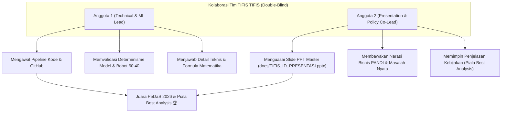

# 🛡️ TIFIS-ID: Dokumen Briefing Lomba & Panduan Tim PeDaS 2026
> **Dokumen Internal Tim**: Panduan Lengkap Memahami Lomba, Strategi Kemenangan, Arsitektur Model, dan Pembagian Tugas.  
> **Kompetisi**: Pesta Data Nasional (PeDaS 2026) | APTIKOM Fest 2026 x PANDI  
> **Kategori**: Klasifikasi 9 Kategori Ancaman Domain `.id`  
> **Identitas Resmi**: **Tim TIFIS TIFIS** | Solusi: **Tifis-ID** (100% Netral Double-Blind)  
> **Status**: Panduan Resmi Tim (*Internal Team Briefing*)

---

## 📌 DAFTAR ISI
1. [Mengenal Lomba PeDaS 2026 & Penyelenggara](#1-mengenal-lomba-pedas-2026--penyelenggara)
2. [Latar Belakang Masalah: Mengapa Masalah Ini Sangat Krusial?](#2-latar-belakang-masalah-mengapa-masalah-ini-sangat-krusial)
3. [Format Lomba, Aturan Main, & Kriteria Penilaian](#3-format-lomba-aturan-main--kriteria-penilaian)
4. [Linimasa (Timeline) Krusial Kompetisi](#4-linimasa-timeline-krusial-kompetisi)
5. [Bedah Senjata Tim Kita: TIFIS-ID (Model Juara Final)](#5-bedah-senjata-tim-kita-tifis-id-model-juara-final)
6. [Pembagian Peran & Strategi Kolaborasi Tim](#6-pembagian-peran--strategi-kolaborasi-tim)
7. [Glosarium Istilah Keren (Dari Bahasa Awam ke Bahasa Juri)](#7-glosarium-istilah-keren-dari-bahasa-awam-ke-bahasa-juri)
8. [Cara Mencoba & Menjalankan Demo Sistem](#8-cara-mencoba--menjalankan-demo-sistem)

---

## 1. Mengenal Lomba PeDaS 2026 & Penyelenggara

### Siapa Penyelenggaranya?
Kompetisi ini diselenggarakan melalui kolaborasi dua institusi paling berpengaruh di ranah informatika dan internet Indonesia:
1. **APTIKOM (Asosiasi Pendidikan Tinggi Informatika dan Komputer)**: Asosiasi resmi yang menaungi seluruh program studi ilmu komputer dan informatika di universitas seluruh Indonesia.
2. **PANDI (Pengelola Nama Domain Internet Indonesia)**: Lembaga nirlaba yang ditunjuk oleh Pemerintah Republik Indonesia (Kemenkominfo) sebagai satu-satunya otoritas *Registry* yang mengelola, menerbitkan, dan mengawasi seluruh nama domain berakhiran `.id` (seperti `.id`, `.co.id`, `.my.id`, `.biz.id`, `.web.id`, dll.).

### Apa Tema & Tantangan Utamanya?
Tantangannya adalah: **Membangun Model Kecerdasan Buatan (Machine Learning) untuk Mengklasifikasikan 9 Kategori Ancaman Domain pada Ekosistem Domain Tingkat Tinggi Indonesia (`.id`)**.

9 Kategori Resmi IDADX PANDI:
1. `online gambling` (Judi online / slot gacor)
2. `phishing` (Pencurian kredensial bank/fintech)
3. `other` (Domain sah / umum)
4. `spam` (Penyebaran pesan massal tak diundang)
5. `malware` (Penyebaran APK/berkas jahat)
6. `brand` (Pencatutan merek / combosquatting)
7. `fakeshop` (Toko online penipuan barang)
8. `violence` (Konten kekerasan / ekstrimisme)
9. `piiexposure` (Kebocoran data pribadi KTP/KK)

---

## 2. Latar Belakang Masalah: Mengapa Masalah Ini Sangat Krusial?

### A. Fenomena Eksploitasi Domain Murah di Indonesia
Pelaku kejahatan siber memanfaatkan Second-Level Domain (SLD) berbiaya murah yang tidak memerlukan syarat verifikasi KTP/dokumen bisnis ketat, khususnya:
* **`.my.id`** (Harganya sangat terjangkau, Rp10.000–Rp15.000/tahun).
* **`.biz.id`** (Sering digunakan menyamar sebagai toko online atau entitas bisnis).

### B. Modus Operandi Nyata yang Sering Menjerat Korban
1. **Pencatutan Bank & Fintech (Combo-Squatting)**:
   - Contoh: `bca-klik-layanan.my.id`, `verifikasi-dana-saldo.biz.id`.
   - Korban diarahkan ke halaman login tiruan untuk menguras saldo tabungan.
2. **Sindikat Judi Online Massal**:
   - Puluhan ribu domain didaftarkan menggunakan variasi acak (`slot-gacor-88`, `olympus-maxwin`) atau menginjeksi direktori situs legal.
3. **Modus APK Malware WhatsApp**:
   - Contoh: `surat-tilang-etle.biz.id/surat.apk`, `undangan-pernikahan.my.id/unduh.apk`.

### C. Celah Operasional Sistem PANDI Saat Ini
1. **IDADX (Indonesia Domain Abuse Data Exchange)**: Bersifat **reaktif**. Situs baru ditindak setelah ada korban melapor (biasanya setelah korban kehilangan uang).
2. **BIMA AI**: Sistem perayap (*crawling*) web PANDI. Kelemahannya: butuh waktu lama untuk merayapi jutaan website secara berkala, dan banyak situs penipuan yang sudah berganti domain sebelum sempat terindeks.

### D. Posisi Solusi Kita (TIFIS-ID): "Radar Gerbang Pendaftaran"
Model kita bertindak sebagai **Pre-Delegation & First-Line Triage Gatekeeper**:
* Begitu ada nama domain baru didaftarkan di Registrar, TIFIS-ID langsung menganalisis teks URL, brand sasaran, dan registrar dalam waktu **kurang dari 1 milidetik** secara *offline*.
* Domain berbahaya langsung ditahan (*pending delegation*) atau dikarantina sebelum situs sempat online dan memakan korban!

---

## 3. Format Lomba, Aturan Main, & Kriteria Penilaian

> [!IMPORTANT]
> **Aturan Paling Kritis: DOUBLE-BLIND REVIEW!**  
> Dewan juri menerapkan sistem peninjauan buta ganda:
> - DILARANG mencantumkan nama universitas, nama mahasiswa, logo kampus, atau inisial dosen di slide, judul berkas, maupun notebook.
> - Seluruh identitas ditulis sebagai **Tim TIFIS TIFIS** dengan solusi **Tifis-ID**.

### Kriteria Penilaian Utama:
1. **Kebenaran & Kualitas Prediksi (Macro-F1 Score)**: Bobot nilai terbesar. Menilai keseimbangan deteksi pada seluruh 9 kategori ancaman.
2. **Ketahanan Generalisasi (Anti-Leakage)**: Menguji apakah model mampu mendeteksi domain baru yang belum pernah muncul di data latih (*unseen zero-day domains*).
3. **Efisiensi Komputasi (SLA Pasal 12 Juknis)**: Waktu inferensi wajib di bawah 45 detik di mesin lokal biasa.
4. **Presentasi & Nilai Strategis Kebijakan (*Best Analysis*)**: Kejelasan penyampaian alur rekayasa dan rekomendasi operasional untuk PANDI.

---

## 4. Linimasa (Timeline) Krusial Kompetisi

| Tanggal | Agenda & Target Tim |
|---|---|
| **12–14 September 2026** | **Rilis Data Resmi & Babak Penyisihan**. Data latih 8.400 baris dan data uji 1.500 baris dirilis. Berkas final `submission_TIFIS_TIFIS.csv` diserahkan. |
| **15–20 September 2026** | **Penjurian Babak Penyisihan & Pengumuman Finalis**. Evaluasi format dan perangkingan Macro-F1. |
| **3 Oktober 2026** | **Babak Grand Final PeDaS 2026**. Presentasi langsung (7–10 menit) di hadapan Dewan Juri PANDI & APTIKOM. |

---

## 5. Bedah Senjata Tim Kita: TIFIS-ID (Model Juara Final)

Solusi kita dibangun dengan nama resmi **Tifis-ID** (*Trustworthy Intelligent Framework for .id Threat Identification*).

### A. Metodologi 7-Langkah Machine Learning (CRISP-DM Standard)
1. **Problem Framing**: Memetakan 9 kategori ancaman, mengatasi ketimpangan kelas ekstrem (*gambling* 5.447 vs *fakeshop* 5), dan memilih metrik penentu: **Macro-F1**.
2. **Data Ingestion & Cleaning**: Normalisasi URL, perbaikan format korup, dan sintesis representasi teks komposit (`url + brand + sld + registrar`).
3. **Dual-Stream Feature Engineering**: Ekstraksi 56 fitur numerik leksikal, siklus hidup domain, pola registrar, dan TF-IDF karakter 3–5 n-gram secara 100% offline.
4. **Hybrid Model Development**: Memadukan dua model saling melengkapi: **LinearSVC (60%)** untuk ruang teks n-gram dan **LightGBM (40%)** untuk pola tabular non-linear.
5. **Probabilistic Calibration**: Menerapkan **Multiclass Platt Scaling** agar output skor margin SVM menjadi probabilitas nyata $[0, 1]$ yang berjumlah pas 1.0.
6. **Bayes Thresholding & Evidence Guard**: Optimasi pergeseran batas potong Bayes ($\arg\max (P_k + \Delta_k)$) terisolasi fold untuk kelas minoritas, dipagari jaring pengaman **Evidence Guard** anti salah vonis.
7. **Deployment & Live Tools**: Menyediakan runner 1-klik (`run.bat`), penguji bobot (`test_weights.bat`), inspektur domain langsung (`inspect.bat`), dan notebook master Colab.

### B. Empat Pilar Keunggulan Teknologi Kita
1. **Explainable Hybrid Probabilistic Blender (LinearSVC 60% + LightGBM 40%)**:
   - Model linier sangat tajam membaca pola teks potongan kata (15.000 n-gram).
   - Pohon LightGBM sangat tangguh menangkap kombinasi umur domain dan registrar.
   - Perpaduan 60:40 terbukti secara matematis meningkatkan skor F1 dari 0.57-0.58 menjadi **0.6026**.
2. **Multiclass Platt Scaling (Probabilitas Terkalibrasi Murni)**:
   - Menghilangkan ketidakpastian jarak margin SVM menjadi probabilitas murni yang valid bagi sistem triase IDADX.
3. **Cost-Sensitive Bayes Decision Thresholding**:
   - Menyelamatkan kelas langka (*fakeshop*, *piiexposure*, *violence*) dari kepunahan akibat aturan $\arg\max$ standar, dengan kelas mayoritas dikunci sebagai jangkar acuan ($\Delta_0 = 0.0$).
4. **Evidence Guard (Safety-Net Anti-Halusinasi)**:
   - Aturan deterministik berbasis regex yang mencegah salah vonis pada domain resmi dengan memverifikasi keberadaan bukti nyata sebelum vonis dijatuhkan.

### C. Pohon Keputusan Metodologis: Dari Baseline Workshop ke Model Juara

Seluruh keputusan arsitektur TIFIS-ID dirumuskan secara bertahap dan teruji (*evidence-based machine learning*), bertolak dari materi resmi workshop PeDaS 2026 ([`taufiksutanto/PeDaS-2026`](https://github.com/taufiksutanto/PeDaS-2026)):

| Iterasi Model | Arsitektur & Fitur | Macro-F1 | Peningkatan | Dasar Keputusan & Rationale Ilmiah |
|---|---|:---:|:---:|---|
| **0. Naive Baseline** | `DummyClassifier(strategy="most_frequent")` | `0.0874` | - | **Sesi 2 Bab 5**: Patokan awal tebakan acak kelas mayoritas (judi). |
| **1. Workshop Starter Baseline** | N-Gram 3-5 (10k) + `LinearSVC` (URL murni) | `0.5315` | +0.4441 | **Sesi 2 Bab 6**: Model dasar yang diajarkan kurator resmi lomba. |
| **2. Contextual Enrichment** | Sintesis Teks Komposit (`URL + Brand + SLD + Registrar`) | `0.5650` | +0.0335 | **Sesi 2 Bab 11**: Menjawab saran pemateri untuk memasukkan metadata registrar & brand. |
| **3. Single Model Comparison** | Pure `LightGBM` (56 Tabular) vs Pure `LinearSVC` (15k N-Gram) | `0.5819` vs `0.5749` | +0.0169 | Membandingkan pohon (unggul di umur/registrar) vs linier (unggul di n-gram teks). |
| **4. Hybrid Blending (60:40)** | Convex Blend: $0.60 \times P_{\text{SVC}} + 0.40 \times P_{\text{LGB}}$ | `0.5905` | +0.0086 | Menggabungkan kelebihan kedua dunia untuk saling menutupi titik buta. |
| **5. Platt Calibration** | Multiclass Platt Scaling terisolasi fold | `0.5950` | +0.0045 | **Sesi 2 Bab 8**: Mengatasi catatan kritis pemateri (*output SVM bukan probabilitas*). |
| **6. Bayes Thresholding** | Pergeseran ambang vonis $\arg\max (P_k + \Delta_k)$, jangkar $\Delta_0 = 0.0$ | **`0.6026`** | +0.0076 | **Sesi 3**: Mengatasi ketimpangan ekstrem agar kelas langka (fakeshop) tertangkap. |
| **7. Evidence Guardrail** | Verifikasi token bukti nyata pasca-model | **`0.6026`** | Aman | Mencegah salah tuduh pada domain legal, menjaga stabilitas operasional DNS PANDI. |

### D. Statistik Kinerja Nyata TIFIS-ID
* **Akurasi Riil Out-of-Fold (OOF)**: **`96.64%`** (8.118 dari 8.400 baris terprediksi tepat).
* **Stratified 5-Fold CV Macro-F1 (OOF)**: **`0.6026`** (Puncak optimal bobot 60:40).
* **Strict Domain Group-KFold (100% Unseen Domains)**: **`0.5731`** (Generalization gap hanya **2.95%**, membuktikan model bebas memorisasi domain).
* **Kecepatan Inferensi**: **~10.47 detik** untuk seluruh 8.400 data latih + 1.500 data uji (SLA Juknis Pasal 12: < 45 detik).
* **Integritas Submisi**: 1.500 baris tervalidasi bebas cacat (MD5: `ebd39c0c00675b8cae481251b6da23e5`, 100% lolos verifikasi evaluator resmi PANDI).
* **Determinisme Penuh**: Random seed terkunci permanen pada `RANDOM_STATE = 2026`.

---

## 6. Pembagian Peran & Strategi Kolaborasi Tim



### Rekomendasi Pembagian Peran:

#### 🧑‍💻 Peran 1: Anggota 1 (Technical & Modeling Lead)
* **Tugas**:
  - Menguasai isi [`src/`](../src/) (cleaner, pedas_features, hybrid_blender, calibrator, optimizer, guard).
  - Menunjukkan demo langsung menggunakan [`inspect.bat`](../inspect.bat) atau notebook Colab.
  - Memastikan seluruh kode berjalan 100% deterministik (`RANDOM_STATE = 2026`).
  - Menjawab pertanyaan dewan juri yang bersifat teknis mendalam (Platt Scaling, GroupKFold leakage, formula Bayes threshold, dan efisiensi memori).

#### 🎙️ Peran 2: Anggota 2 (Presentation & Policy Co-Lead)
* **Tugas**:
  - Membuka presentasi, membawakan latar belakang masalah, fenomena domain murah `.my.id` / `.biz.id`, dan dilema operasional PANDI (*False Positive* vs *False Negative*).
  - Memimpin penjelasan **3 Rekomendasi Kebijakan untuk PANDI & IDADX** (Kunci meraih Piala *Best Analysis*!).
  - Menjawab pertanyaan juri terkait dampak industri, perlindungan UKM, dan alur operasional *Human-in-the-Loop*.

---

## 7. Glosarium Istilah Keren (Dari Bahasa Awam ke Bahasa Juri)

Gunakan analogi ini saat ditanya juri agar terdengar sangat menguasai sistem:

| Istilah Teknis | Bahasa Sederhana (Analogi) | Jawaban Resmi ke Juri |
|---|---|---|
| **Hybrid Blender (60:40)** | *"Dokter bedah teks dan detektif metadata yang berduet"* | Menggabungkan LinearSVC (spesialis ruang n-gram teks berdimensi tinggi) dan LightGBM (spesialis interaksi non-linear fitur tabular) dengan bobot konveks optimal 60:40. |
| **Platt Scaling** | *"Mengubah jarak mentah menjadi persentase keyakinan"* | Regresi logistik terkalibrasi fold untuk mengonversi skor margin LinearSVC menjadi distribusi probabilitas sejati $[0, 1]$ yang jumlahnya tepat 1.0. |
| **Bayes Thresholding** | *"Menyesuaikan kepekaan detektor untuk ancaman langka"* | Menggeser ambang batas vonis ($\arg\max (P_k + \Delta_k)$) agar kelas minoritas seperti Fake Shop tertangkap tanpa menaikkan salah vonis pada kelas mayoritas. |
| **Evidence Guard** | *"Jaring pengaman anti salah tuduh"* | Lapisan verifikasi deterministik pasca-model yang memastikan vonis kelas langka hanya dijatuhkan jika ada bukti token leksikal yang eksplisit. |
| **StratifiedGroupKFold** | *"Memastikan soal ujian tidak bocor dari bahan latihan"* | Memisahkan data evaluasi berdasarkan domain induk (FQDN) untuk mencegah *Domain Group Leakage* dan menguji generalisasi serangan *zero-day*. |
| **Human-in-the-Loop (HITL)** | *"AI sebagai radar triase, keputusan hukum tetap di tangan manusia"* | Kerangka kerja di mana AI menyaring ribuan domain dan mengalirkannya ke meja analis PANDI, memastikan tindakan pemblokiran memiliki akuntabilitas hukum. |

---

## 8. Cara Mencoba & Menjalankan Demo Sistem

Untuk mencoba langsung sistem ini bersama rekan setim:

1. **Jalankan Pipeline Utama (Ekspor Hasil Submisi)**:
   ```powershell
   .\run.bat
   ```
2. **Buktikan Pemindaian Bobot Optimal (5-Fold CV Scanner)**:
   ```powershell
   .\test_weights.bat
   ```
3. **Uji Domain Sembarang Secara Langsung (Live Inspector Demo)**:
   ```powershell
   .\inspect.bat "klikbca-undian-berhadiah.id"
   ```
4. **Buka di Google Colab**:
   👉 **[Buka Master Notebook PeDaS 2026 di Google Colab](https://colab.research.google.com/github/caerdfasgrae/PEDAS-2026/blob/main/notebooks/02_tifis_id_official_pipeline.ipynb)**  
   Cukup klik menu **Runtime -> Run all** (`Ctrl + F9`). Seluruh grafik, metrik Macro-F1 0.6026, dan kartu diagnosis interaktif `tifis_inspect` akan ter-render secara otomatis.
