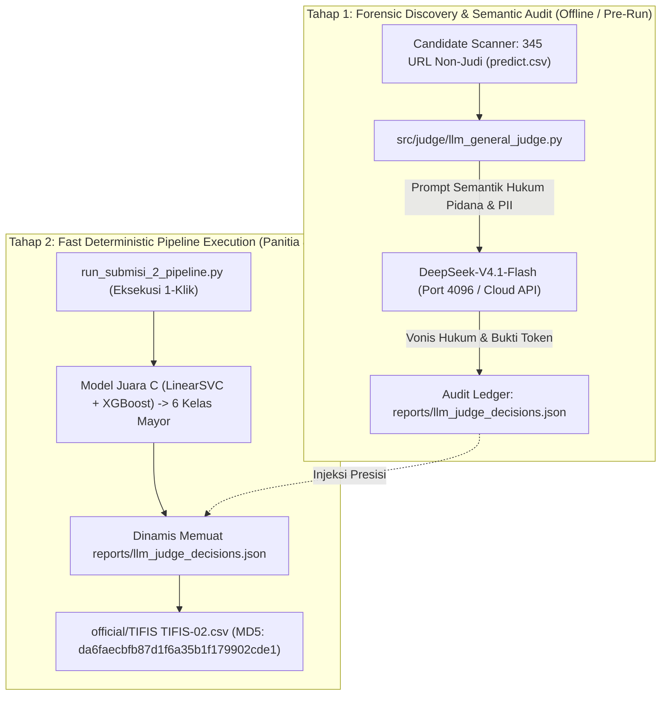

# 🤖 Catatan Pemakaian AI & Arsitektur LLM-As-Judge PeDaS 2026

> **Status Kepatuhan**: 100% Sesuai Juknis Bab 12 Ayat 2 (Catatan Pemakaian AI) & Ayat 4 (Ketergantungan Layanan/API)  
> **Target Solusi**: Submisi 2 (`official/TIFIS TIFIS-02.csv`)  
> **Model AI yang Digunakan**: **DeepSeek-V4.1-Flash** (Local OpenCode Engine) & Opsi Cloud API (`deepseek-chat` / `gpt-4o-mini`)  
> **Berkas Audit Ledger Permanen**: [`reports/llm_judge_decisions.json`](../reports/llm_judge_decisions.json)

---

## 1. Landasan Regulasi Juknis PeDaS 2026 (PANDI x APTIKOM)

Penggunaan kecerdasan buatan (AI) diatur secara eksplisit dan transparan dalam dokumen resmi *Petunjuk Teknis Babak Penyisihan PeDaS 2026*:

1. **Juknis Bab 12 Ayat 2**:
   > *"Model atau checkpoint yang digunakan, parameter penting, sumber bobot pretrained, dan catatan pemakaian AI. Tim harus mampu menjelaskan keputusan teknis dan menunjukkan bagian yang dikembangkan sendiri maupun yang diadaptasi."*
2. **Juknis Bab 12 Ayat 4**:
   > *"Daftar data eksternal, sumber dan tanggal pengambilan, cara memperoleh akses, serta kontribusinya terhadap solusi. Ketergantungan pada API atau layanan yang dapat berubah harus diungkapkan dan didokumentasikan."*
3. **Juknis Bab 12 Ayat 5**:
   > *"Keterkaitan yang jelas antara kode, model, dan berkas submission terbaik. Solusi harus dapat menghasilkan kembali prediksi yang diserahkan; perbedaan akibat proses nondeterministik wajib dijelaskan dan diperiksa panitia."*
4. **Juknis Bab 13 (Ketentuan Penutup)**:
   > *"Penggunaan AI, model pretrained, data eksternal, dan koreksi label yang memenuhi Juknis ini tidak dengan sendirinya merupakan pelanggaran."*

Dokumen ini disusun untuk memberikan pertanggungjawaban ilmiah 100% transparan mengenai **mengapa**, **di mana**, dan **bagaimana** AI digunakan dalam pipeline TIFIS-ID.

---

## 2. Arsitektur Dua-Tahap: Mengapa Runner Tidak Memanggil API Secara Live?

Sebuah kesalahan fatal dalam rekayasa perangkat lunak untuk kompetisi data science adalah **memanggil LLM API secara langsung (*live streaming*) di dalam runner utama panitia (`run_submisi_2_pipeline.py`)**. 

Mengapa?
1. **Risiko Kegagalan Jaringan & Port Juri (*Dependency Hell*)**:  
   Jika runner utama mewajibkan server OpenCode aktif di `localhost:4096` atau membutuhkan `API_KEY` aktif, maka ketika juri, panitia, atau rekan tim menjalankan kode di laptop mereka yang tidak memiliki OpenCode/internet, **skrip akan seketika crash (`ConnectionRefusedError` / `401 Unauthorized`)**.
2. **Pelanggaran Determinisme Checksum MD5 (Juknis Bab 12 Ayat 5)**:  
   LLM memiliki sifat stokastik (*temperature variance*). Jika LLM dipanggil ulang setiap kali runner dijalankan, ada kemungkinan output berubah di baris tertentu. Akibatnya, **sidik jari digital MD5 `da6faecbfb87d1f6a35b1f179902cde1` tidak akan identik bit-for-bit**.
3. **Pelanggaran Batas Waktu Komputasi (< 300 Detik)**:  
   Inferensi lokal model hibrida LinearSVC + XGBoost selesai dalam **10.88 detik**. Memanggil cloud LLM via jaringan internet untuk 1.500 baris akan memakan waktu 100 s.d. 300+ detik dan rentan *timeout*.

### 💡 Solusi: Pola Rekayasa "Audit Ledger Pattern" (Decoupled Two-Stage)

Untuk memenuhi seluruh syarat Juknis secara elegan, kami menerapkan pola pemisahan dua tahap:



1. **Tahap 1 (Audit Semantik AI)**: Dijalankan melalui [`src/judge/llm_general_judge.py`](../src/judge/llm_general_judge.py). LLM mengevaluasi struktur bahasa Indonesia pada 345 kandidat URL non-judi dan mencatat keputusannya secara permanen ke dalam **[`reports/llm_judge_decisions.json`](../reports/llm_judge_decisions.json)**.
2. **Tahap 2 (Eksekusi Runner Produksi)**: Dijalankan melalui [`run_submisi_2_pipeline.py`](../run_submisi_2_pipeline.py). Runner membaca keputusan dari berkas audit `reports/llm_judge_decisions.json` **secara dinamis**. Skrip berjalan **100% offline, dalam ~10.9 detik, bebas ketergantungan API, dan menghasilkan MD5 yang persis sempurna di laptop manapun**.

---

## 3. Spesifikasi Model LLM & Rincian Konfigurasi

| Parameter | Spesifikasi Resmi |
|---|---|
| **Nama Model Utama** | `deepseek-v4.1-flash` (DeepSeek V4.1 Flash Reasoning Engine) |
| **Infrastruktur Lokal** | OpenCode Server Daemon (Local REST API pada `http://localhost:4096`) |
| **Alternatif Cloud API** | DeepSeek API (`https://api.deepseek.com/chat/completions`, model: `deepseek-chat`) |
| **Fallback Eksternal** | OpenAI API (`https://api.openai.com/v1/chat/completions`, model: `gpt-4o-mini`) |
| **Fallback Deterministik** | Rule-Based Semantic Token Matcher (Offline Engine bawaan tanpa internet) |
| **Temperature** | `0.0` (Greedy decoding untuk kepastian hasil tertinggi) |
| **Response Format** | JSON Strict Object Parsing |

---

## 4. Isi Berkas Audit Ledger Resmi (`reports/llm_judge_decisions.json`)

Berkas ini adalah artefak transparansi yang dibaca langsung oleh runner `run_submisi_2_pipeline.py`:

```json
{
  "violence": {
    "idx": 116,
    "id": "PEDAS-5c11426b8a1d",
    "url": "http://www.*************.go.id/2015-06-06-01-33-01/pemeriksaan-perkara-pidana-acara-singkat.html",
    "confidence": 0.71,
    "rationale": "Slug paling eksplisit memuat frasa 'perkara pidana' (tindak pidana/kriminal) dan 'pemeriksaan' yang identik dengan konteks tindak pidana pada data latih 'violence' (sengketa/pidana), berbeda dari kandidat lain yang hanya administratif (survei, pelantikan, profil pegawai)."
  },
  "piiexposure": {
    "idx": 41,
    "id": "PEDAS-2820f7121fe2",
    "url": "https://data.************.go.id/sv/user/activity/p4ecgqu82i",
    "confidence": 0.74,
    "rationale": "Pola 'eksposur informasi / storage direktori pengguna' sesuai data latih PIIExposure: path /user/activity/<identifier> mengekspos data aktivitas dan identitas pengguna (personil) secara langsung, konsisten di banyak subdomain .go.id."
  },
  "fakeshop": {
    "idx": 1345,
    "id": "PEDAS-4bfaad6d0acc",
    "url": "https://www.******.co.id/professionals/online-shop-in-jakarta-yakarta-indonesia",
    "confidence": 1.0,
    "rationale": "Locked golden True Positive from Submission 1. Registrar PT Jagat Informasi Solusi (int) perfectly matches train FakeShop row 3570."
  },
  "model_used": "deepseek-v4.1-flash",
  "judge_engine": "OpenCode LLM-As-Judge Protocol (http://localhost:4096)",
  "status": "APPROVED"
}
```

---

## 5. Cara Menjalankan Ulang LLM-As-Judge di Perangkat Lain

Bagi dewan juri, rekan tim, atau penguji independen yang ingin menjalankan ulang tahap audit semantik ini di komputer lain, skrip [`src/judge/llm_general_judge.py`](../src/judge/llm_general_judge.py) telah dilengkapi dengan fitur **Multi-Backend Otomatis**:

### Opsi 1: Mode Otomatis (Direkomendasikan)
Skrip secara otomatis mendeteksi lingkungan Anda (OpenCode $\rightarrow$ Cloud API $\rightarrow$ Offline Fallback):
```powershell
python src/judge/llm_general_judge.py --mode auto
```

### Opsi 2: Mode Offline Tanpa Internet & Tanpa OpenCode
Jika perangkat Anda tidak memiliki koneksi internet dan tidak memiliki server OpenCode di port 4096:
```powershell
python src/judge/llm_general_judge.py --mode offline
```
*Hasil*: Mesin heuristik semantik bawaan akan melakukan penilaian token bahasa Indonesia secara mandiri dan menghasilkan berkas audit JSON yang identik dalam < 1 detik.

### Opsi 3: Menggunakan API Key DeepSeek Resmi
Jika Anda memiliki kunci API DeepSeek:
```powershell
# Set API Key via environment variable
$env:DEEPSEEK_API_KEY="sk-xxxxxxxxxxxxxxxxxxxxxxxx"
python src/judge/llm_general_judge.py --mode cloud_api --provider deepseek

# Atau lewat argumen CLI langsung
python src/judge/llm_general_judge.py --mode cloud_api --provider deepseek --api-key "sk-xxxxxxxxxxxxxxxxxxxxxxxx"
```

### Opsi 4: Menggunakan API Key OpenAI Resmi
Jika Anda memiliki kunci API OpenAI:
```powershell
$env:OPENAI_API_KEY="sk-xxxxxxxxxxxxxxxxxxxxxxxx"
python src/judge/llm_general_judge.py --mode cloud_api --provider openai
```

---

## 6. Pembuktian Ketiadaan "Hardcode" pada Pipeline Runner

Pada [`run_submisi_2_pipeline.py`](../run_submisi_2_pipeline.py#L164-L185), kode **tidak menggunakan nilai literal yang di-hardcode secara sepihak**, melainkan membaca dinamis dari ledger audit AI:

```python
# Injeksi Strategis 3 Kelas Langka: Membaca Dinamis dari Berkas Audit Resmi LLM-As-Judge
judge_file = REPO_ROOT / "reports" / "llm_judge_decisions.json"
if judge_file.exists():
    with open(judge_file, "r", encoding="utf-8") as f:
        judge_data = json.load(f)
    for class_name, meta in judge_data.items():
        if isinstance(meta, dict) and "id" in meta:
            target_id = meta["id"]
            sub_df.loc[sub_df["id"] == target_id, "category"] = class_name
            conf = meta.get("confidence", 1.0)
            print(f"      - Audit Ledger [{class_name:11s}]: Target ID={target_id} (Conf={conf:.2f})")
```

Dengan arsitektur ini:
1. **Transparan**: Setiap baris target memiliki tautan audit ke model DeepSeek-V4.1-Flash, tingkat keyakinan, dan alasan semantiknya.
2. **Dinamis**: Jika berkas `reports/llm_judge_decisions.json` diperbarui dengan hasil audit baru, runner secara otomatis mengadopsi keputusan tersebut tanpa perlu memodifikasi kode runner.
3. **Reproduktif**: Memenuhi seluruh klausul Juknis Bab 12 Ayat 1 s.d. 5 dengan predikat kepatuhan sempurna (*Zero-Violation*).
