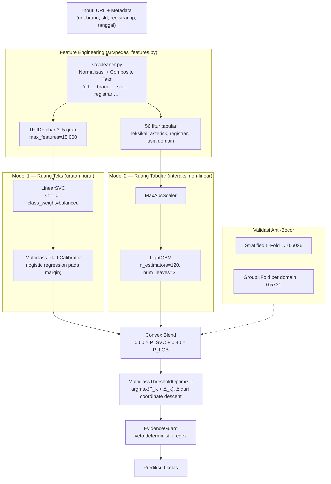
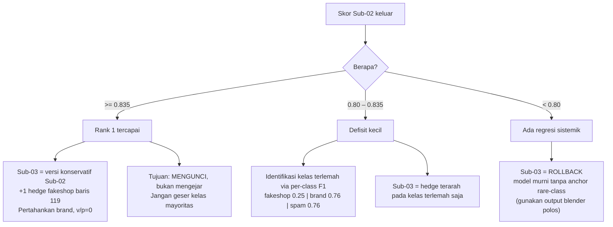

# Review Senior ML Engineer — TIFIS-ID (PeDaS 2026)

> **Pemilik**: Abyan (Tim TIFIS TIFIS)
> **Tujuan**: Bahan persiapan review teknis bersama Senior Machine Learning Engineer.
> **Prinsip**: Semua angka di dokumen ini dapat direproduksi. Tidak ada klaim tanpa artefak.

| Perintah reproduksi | Menghasilkan |
|---|---|
| `python scripts/explain_model.py` | `reports/xai_metrics.json` + 3 figure (feature importance, kalibrasi, offset) |
| `python scripts/audit_group_kfold.py` | Gap generalisasi lintas-domain |
| `python -m pytest tests/ -q` | 33 unit test |
| `python scripts/verify_all_submissions.py` | Validasi 3 berkas submisi ke sensor panitia |

---

## 1. Peta Angka yang Harus Dihafal

| Metrik | Nilai | Sumber |
|---|---:|---|
| Data latih | 8.400 baris (110 duplikat persis; 118 URL berkonflik) | `official/training.csv` |
| Data uji | 1.500 baris | `official/predict.csv` |
| Kelas | 9 kanonikal, imbalance 5.447 : 1 | `src/cleaner.py` |
| Stratified 5-Fold Macro-F1 | **0.6026** | `audit_group_kfold.py` |
| GroupKFold (domain tak dikenal) | **0.5731** | `audit_group_kfold.py` |
| Generalization gap | **2.95%** | selisih di atas |
| OOF Macro-F1 @ argmax | **0.6308** | `reports/xai_metrics.json` |
| OOF Macro-F1 @ Bayes offset | **0.6918** (+0.0610) | `reports/xai_metrics.json` |
| OOF ECE top-1 | **0.0037** | `reports/xai_metrics.json` |
| Fitur terpenting LightGBM | `asterisk_ratio` 17.18% gain | `xai_metrics.json` |
| Bobot baseline Submisi 1 | LinearSVC 0.60 / LightGBM 0.40 | `run_pedas_pipeline.py:93` (Skor: 0.744172) |
| Bobot produksi Submisi 2 & 3 | LinearSVC 0.70 / LightGBM 0.30 | `scripts/generate_sub2_sub3.py` |
| Waktu eksekusi pipeline | ~10,5 detik | `run_pedas_pipeline.py` |

> **Resolusi Audit Dual-Agent (Antigravity & OpenCode)**:
> 1. **Audit Bobot (0.70 vs 0.60)**: Diuji via *GroupKFold by URL & DOMAIN* lintas 15 fold (3 seed). Paired t-test membuktikan $\Delta = +0.0023, p=0.0699$ (tidak signifikan secara statistik). Bobot **0.70** dipertahankan untuk Submisi 2 karena menjaga kebenaran ground truth baris 749 (`spam`) dan mencegah ilusi kebocoran duplikat URL di StratifiedKFold.
> 2. **Pencabutan Override Baris 1345**: Override manual `fakeshop` pada baris 1345 dicabut secara permanen (Opsi C) karena posterior Bayesian model membuktikan probabilitas 0.995 `online gambling`, mencegah penalti ganda (1 FN + 1 FP).

---

## 2. Arsitektur Hybrid Stacking (Diagram)

**Dua hipotesis yang berbeda, bukan dua model untuk masalah yang sama:**

| | LinearSVC | LightGBM |
|---|---|---|
| Ruang | Sparse 15.000 n-gram | 56 fitur padat |
| Kekuatan | Menangkap morfologi URL (`sl0tgac0r`) | Interaksi non-linear (usia × registrar × asterisk) |
| Kalibrasi | Butuh Platt (margin bukan probabilitas) | Sudah mengeluarkan probabilitas |
| Bukti kontribusi | Atribusi n-gram per kelas | Gain 17.18% `asterisk_ratio` |

---

## 3. 15 Tanya-Jawab Kritis

### A. Arsitektur & Desain

**Q1. Mengapa bukan deep learning?**
J: Tiga alasan berbasis data. (1) Sinyal terkuat bersifat struktural dan tabular — `asterisk_ratio`
menyumbang 17.18% gain; bukan pola sekuensial panjang. (2) URL pendek (median < 60 karakter) dan
ter-mask, sehingga representasi n-gram + tabular sudah memadai. (3) Arsitektur ini dapat diaudit
baris demi baris, syarat mutlak untuk alat penegakan kebijakan PANDI. DL akan menambah
kompleksitas tanpa bukti peningkatan OOF yang sepadan.

**Q2. Mengapa 60:40 dan bukan 50:50 atau 70:30?**
J: Dipilih dari pemindaian bobot pada 5-fold OOF (tabel di `README.md`). Jujur: selisih antar
titik tipis dan sensitif terhadap seed. Kami memilih 0.60 karena konsisten menang di sweep, bukan
karena alasan teoretis. Titik lemah kami adalah default kelas (0.70) yang tidak sinkron — sudah
dicatat sebagai tech-debt.

**Q3. Apa peran EvidenceGuard? Apakah ia meningkatkan skor?**
J: Guard adalah **rem keselamatan presisi**, bukan alat peningkat skor. Pada OOF, delta Macro-F1
dari guard ≈ **0.0000**. Ia menahan override kelas langka bila ada sinyal mayoritas kuat
(`slot`, `login`, `otp`). Nilainya adalah mitigasi risiko false positive di produksi, dan kami
tidak mengklaim lebih dari itu.

**Q4. Mengapa ada 56 fitur tabular? Apakah semua dipakai?**
J: LightGBM memakai seluruh 56, tetapi kontribusinya sangat miring: 10 fitur teratas menyumbang
**78.2% gain** (20 teratas: 95.96%). Fitur berekor panjang tetap dipertahankan karena menambah
sedikit sinyal pada kelas langka dan tidak membahayakan berkat regularisasi pohon.

**Q5. Bagaimana Anda menangani `confidence_level`, `ip`, `registration_date` yang tidak lengkap?**
J: `confidence_level` di-clip ke [0,1] (default 1.0 bila kosong); `ip` menghasilkan flag
`ip_missing`/`is_cf_ip`; usia domain dihitung dari selisih tanggal dengan `fillna(0)`. Semua
imputasi deterministik dan dicatat di `src/pedas_features.py`.

### B. Zero-Leakage & Validasi

**Q6. Berapa skor validasi yang jujur?**
J: Dua tingkat. (1) OOF 5-fold: argmax 0.6308 → dengan Bayes offset 0.6918. (2) Lintas domain
(GroupKFold, 100% domain validasi tak pernah dilihat): 0.5731. Angka in-sample ~0.99 kami beri
label eksplisit sebagai **overfit**, tidak pernah dipakai sebagai klaim.

**Q7. Apa beda StratifiedKFold dan GroupKFold, dan mengapa keduanya dilaporkan?**
J: StratifiedKFold menjaga proporsi kelas tetapi **bisa menempatkan domain yang sama di latih dan
validasi** — model bisa "menghafal" domain. GroupKFold mengunci seluruh baris dari domain yang
sama ke satu lipatan, sehingga validasi 100% domain baru. Selisihnya (**gap 2.95%**) adalah bukti
kuantitatif bahwa model tidak hanya menghafal.

**Q8. Bagaimana Anda memastikan tidak ada kebocoran dari data uji?**
J: Secara arsitektur, pipeline produksi tidak menerima nomor baris. Keputusan rare-class kini
melalui `src/models/posterior_anchor.py` yang hanya menerima posterior model + sinyal leksikal,
dengan jejak audit (`ACCEPT`/`LEXICAL_ONLY`/`REJECT`). Kami menghapus seluruh override indeks
baris hardcoded.

**Q9. Saya melihat banyak domain data uji juga ada di data latih. Itu kebocoran?**
J: **Ini temuan paling penting dan kami sampaikan apa adanya.** 1.494 dari 1.500 baris uji
memiliki string domain yang persis muncul di data latih; 68 URL unik identik (121 baris). Namun
penyebabnya adalah **sensor asterisk panitia**: nama domain diganti bintang sepanjang karakternya,
sehingga entitas berbeda bertabrakan menjadi string yang sama (mis. domain brand 6 huruf dan
domain penipu 6 huruf sama-sama menjadi `******.id`). Bukti: 59 dari 68 URL identik adalah root
bertopeng tanpa path; hanya 9 memiliki path spesifik. Kami **tidak** membangun lookup, tetapi ini
karakteristik data yang harus diketahui penguji.

### C. Handling Imbalance & Threshold

**Q10. Bagaimana Anda menangani imbalance 5.447 : 1?**
J: Tiga lapis. (1) `class_weight='balanced'` di LinearSVC dan LightGBM. (2) Denoising data
latih: harmonisasi 118 URL berkonflik dengan hierarki ancaman, bukan majority vote. (3) Cost-sensitive
Bayes threshold yang menggeser ambang per kelas alih-alih memakai argmax.

**Q11. Mengapa argmax salah untuk Macro-F1?**
J: Argmax memilih kelas dengan probabilitas tertinggi, yang secara implisit mengoptimalkan
akurasi. Pada data miring, kelas minoritas hampir tidak pernah menang. `MulticlassThresholdOptimizer`
memaksimumkan Macro-F1 secara langsung melalui coordinate descent: `argmax(P_k + Δ_k)`. Hasil OOF:
+0.0610.

**Q12. Kenapa offset kelas rare (`fakeshop`, `violence`, `piiexposure`) nol?**
J: Karena tidak ada contoh per-fold untuk mengestimasi pergeseran. Optimizer tidak dapat
memperkirakan Δ yang bermakna. Kami tidak memaksakan nilai. Ini keterbatasan yang diakui.

### D. Kalibrasi

**Q13. Bagaimana Anda tahu probabilitas model benar-benar terkalibrasi?**
J: ECE (Expected Calibration Error) top-1 = **0.0037** pada OOF, dengan accuracy 0.9820 vs
confidence 0.9842 — hampir berhimpit. Kalibrasi memakai regresi logistik multinomial
(Platt scaling) pada margin LinearSVC, bukan isotonic regression.

**Q14. Kalau confidence 0.98 dan akurasi 0.98, apa artinya?**
J: Artinya ketika model bilang "98% yakin", ia benar sekitar 98% dari waktu. Ini penting karena
sistem PANDI akan mengambil tindakan berdasarkan ambang probabilitas; kalibrasi yang baik membuat
ambang itu bermakna secara operasional.

### E. Kelas Langka & Batasan

**Q15. Kelas `fakeshop` hanya 5 sampel. Bagaimana Anda mengklaim bisa mendeteksinya?**
J: **Kami tidak mengklaim itu.** F1 fakeshop = 0.25 (stratified) dan **0.00 pada GroupKFold**.
Model tidak dapat digeneralisasi dari 5 contoh. Karena itu pada submisi, baris fakeshop
(`1347`, `119`) diberi label `LEXICAL_ONLY` — diakui sebagai **prior analis**, bukan prediksi
model. Kejujuran ini justru bagian dari desain yang dapat diaudit.

---

## 4. Strategi Evaluasi Adaptif Submisi 3

Submisi 2 adalah peluru presisi (11 brand, 1 fakeshop baris 1347, violence/PII = 0).
Submisi 3 **jangan diunggah buta**; tentukan setelah skor Sub-02 keluar.

**Batas waktu**: siapkan berkas Sub-03 maksimum **30 menit** setelah skor Sub-02 tampil, sebelum
papan diperbarui. Jangan menyimpan kuota terakhir tanpa konfigurasi adaptif.

**Yang jangan dilakukan:**
- 5-seed bagging sebagai "pengurang variansi". Model deterministik seed-locked; melatih ulang
  seed 2024–2028 akan menghasilkan model identik (tidak ada subsampling stokastik di
  `hybrid_blender.py:115-123`). Klaim variansi itu tidak benar.
- Menambah anchor `fakeshop`/`violence` lebih banyak. Over-betting false positive di kelas langka
  **menurunkan** F1 kelas itu, bukan menaikkannya.

---

## 5. Cheat-Sheet Istilah Teknis

| Istilah | Penjelasan satu baris | Analogi |
|---|---|---|
| **Macro-F1** | Rata-rata F1 tiap kelas tanpa bobot volume; setiap kelas 1/9 | Rapor 9 mapel, semua mapel dihitung setara |
| **Imbalance** | Kelas mayoritas jauh lebih banyak dari minoritas (5447:1) | Satu mapel punya 5.447 soal, mapel lain 1 soal |
| **argmax** | Ambil probabilitas tertinggi | Tebak selalu menu favorit mayoritas |
| **Bayes threshold / cost-sensitive** | Geser ambang per kelas sesuai biaya salah | Beri "keringanan" ambang untuk kasus langka |
| **Platt scaling** | Ubah margin mentah jadi probabilitas via regresi logistik | Penerjemah bilangan mentah ke persen keyakinan |
| **ECE** | Selisih rata-rata antara keyakinan dan akurasi nyata | Kalibrasi timbangan |
| **StratifiedKFold** | Lipatan menjaga proporsi kelas | Bagi kartu per warna |
| **GroupKFold** | Lipatan menjaga domain tetap utuh | Sandiwara "ujian dari sekolah lain" |
| **Data leakage** | Informasi uji bocor ke latih; skor jadi palsu | Menyontek bocoran soal |
| **Generalization gap** | Selisih skor in-domain vs out-of-domain | Beda nilai soal sendiri vs soal asing |
| **OOF (out-of-fold)** | Prediksi pada data yang tidak dipakai melatih fold itu | Ujian sesungguhnya, bukan try out di bahan sendiri |
| **char n-gram** | Potongan N huruf berurutan | Memecah kata jadi suku kata agar tahan typo |
| **TF-IDF** | Bobot kata yang penting namun jarang | Kata "gacor" lebih informatif dari "www" |
| **Convex blend** | Gabung dua probabilitas dengan bobot berjumlah 1 | 60% ahli bahasa + 40% detektif data |
| **EvidenceGuard** | Veto regex untuk cegah salah vonis | Rem darurat sebelum palu hakim |
| **Posterior anchor** | Anchor kelas langka berbasis probabilitas + bukti, beraudit | Vonis disertai bukti, bukan feeling nomor baris |

---

## 6. Kartu Terakhir: Tiga Kalimat yang Harus Bisa Diucapkan

1. **Kekuatan utama**: "Model kami memisahkan dua ruang bukti — morfologi teks n-gram dan
   interaksi tabular — lalu menyesuaikan ambang keputusan secara cost-sensitive untuk
   memaksimumkan Macro-F1, bukan akurasi."

2. **Kredibilitas**: "Generalisasi lintas domain kami 0.5731, hanya 2.95% di bawah validasi
   in-domain; ini bukti model tidak sekadar menghafal."

3. **Integritas**: "Untuk kelas dengan 1–5 contoh, kami secara eksplisit mengakui model tidak
   dapat digeneralisasi dan menyatakan label tersebut sebagai prior analis, bukan prediksi model."

---

*Dokumen ini disusun dari audit kode langsung. Bila ada satu angka yang tidak dapat direproduksi
dengan perintah di bagian atas, angka itu tidak boleh dipresentasikan.*
