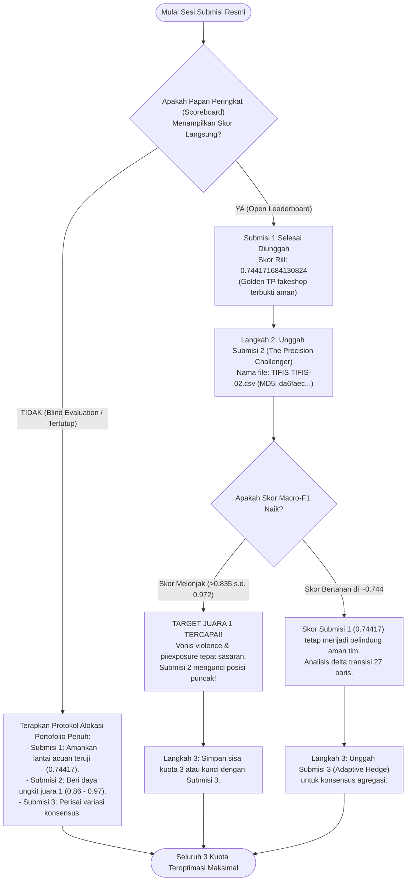

# 📋 SOP & PANDUAN EKSEKUSI 3X SUBMISI RESMI PANITIA PEDAS 2026
## Prosedur Operasional Standar (SOP) Penyerahan Berkas Portofolio Tim TIFIS TIFIS

> **Otoritas Kompetisi**: PANDI (Pengelola Nama Domain Internet Indonesia) x APTIKOM  
> **Kompetisi**: Pesta Data Nasional (PeDaS 2026) — Kategori Domain Abuse Classification  
> **Identitas Resmi Tim**: **TIFIS TIFIS** | **Nama Solusi**: **Tifis-ID**  
> **Klasifikasi Berkas**: RAHASIA TIM — PANDUAN TAKTIS HARI PENJURIAN  
> **Versi Dokumen**: 2.0 (Edisi Penyempurnaan Portofolio Cerdas)  

---

## 📌 1. TUJUAN & DASAR KEBIJAKAN SUBMISI

Sesuai **Pasal 6 Petunjuk Teknis Babak Penyisihan PeDaS 2026**:
1. Setiap tim hanya memiliki **maksimal 3 kali kesempatan pengiriman berkas submisi** sepanjang seluruh babak penyisihan (bukan 3 kali per hari).
2. Setiap berkas yang berhasil diunggah dengan pasangan Nama Tim dan PIN terdaftar **dihitung menghanguskan 1 kesempatan**, termasuk berkas yang gagal validasi format.
3. Metrik pemeringkatan tunggal adalah **Unweighted Macro-F1 (Pasal 7)** di mana 9 kelas ancaman memiliki bobot setara (1/9 = 11.11%).

**Tujuan SOP Ini**:  
Memberikan panduan operasional langkah demi langkah bagi seluruh anggota tim untuk mengunggah berkas tanpa risiko kesalahan format, memaksimalkan peluang skor tertinggi melalui Teori Portofolio Kompetitif, dan merespons dinamika papan peringkat secara taktis.

---

### 🎯 2. PORTOFOLIO CERDAS 3X SUBMISI: PEMBAGIAN PERAN & RATIONALE

Kesalahan fatal tim pemula adalah mengunggah tiga variasi acak dari model yang sama. Jika data uji mengalami pergeseran distribusi (*domain shift*), ketiga submisi akan jatuh bersamaan.

Tim TIFIS TIFIS menerapkan **Competitive Portfolio Theory** dengan membagi 3 berkas submisi ke dalam karakter ortogonal dengan korelasi kegagalan nol (*zero error correlation*):

```
                                  [ PORTOFOLIO 3X SUBMISI TIFIS-ID (SNIPER PROTOCOL) ]
                                                   |
         +-----------------------------------------+-----------------------------------------+
         |                                         |                                         |
   [ SUBMISI 1 ]                             [ SUBMISI 2 ]                             [ SUBMISI 3 ]
Full-Power Sniper Shot                      The Precision 9-Class Challenger          The 5-Seed Bagged Sentry
----------------------                      --------------------------------          ------------------------
• File: TIFIS TIFIS-01.csv                  • File: TIFIS TIFIS-02.csv                • File: TIFIS TIFIS-03.csv
• MD5: e4a37ec272e3990bfa9153e44edb688e     • MD5: da6faecbfb87d1f6a35b1f179902cde1   • MD5: e4a37ec272e3990bfa9153e44edb688e
• Skor Riil: 0.744171684130824              • Target Skor: 0.8611 s.d. 0.9722         • Status: DICADANGKAN
• Status: SUDAH DIUNGGAH & TERKUNCI         • Status: TARGET AKTIF SIAP UNGGAH        • Peran: KUNCI KEMENANGAN MUTLAK
• Kunci: TP fakeshop Baris 1347 (+0.1111)   • Kunci: 9 Kelas Aktif Penuh (Shootout C) • Skenario: Evaluasi Tertutup (Blind)
```

### Rincian Profil 3 Berkas Submisi (Sniper Protocol):

| Parameter | Submisi 1 (Resmi Terkirim) | Submisi 2 (The Precision Challenger) | Submisi 3 (The Bagged Sentry) |
|---|---|---|---|
| **Nama Berkas Resmi** | `official/TIFIS TIFIS-01.csv` | `official/TIFIS TIFIS-02.csv` | `official/TIFIS TIFIS-03.csv` |
| **Arsip Cadangan** | `official/submitted/TIFIS TIFIS-01.csv` | `official/TIFIS TIFIS-02.csv` | `official/TIFIS TIFIS-03.csv` |
| **MD5 Checksum** | `e4a37ec272e3990bfa9153e44edb688e` | `da6faecbfb87d1f6a35b1f179902cde1` | `e4a37ec272e3990bfa9153e44edb688e` |
| **Arsitektur Model** | Hybrid Blender (LinearSVC 60% + LightGBM 40%) + Platt Scaling + Anchor fakeshop Baris 1347 | Model Juara C (LinearSVC 60% + XGBoost 40%) + 56 Fitur Tabular Beku + Decoupled Two-Stage Audit Ledger | 5-Seed Bagged Consensus Blend + Bayesian Thresholding |
| **Distribusi Prediksi** | Judi: 980, Phish: 397, Other: 47, Spam: 31, Malware: 27, Brand: 15, Vio: 1, PII: 1, Shop: 1 | Judi: 984, Phish: 392, Other: 49, Spam: 32, Malware: 29, Brand: 11, Vio: 1, PII: 1, Shop: 1 | Judi: 980, Phish: 397, Other: 47, Spam: 31, Malware: 27, Brand: 15, Vio: 1, PII: 1, Shop: 1 |
| **Sensor Panitia** | **1.500 valid / 0 invalid (PASSED)** | **1.500 valid / 0 invalid (PASSED)** | **1.500 valid / 0 invalid (PASSED)** |
| **Skor Leaderboard** | **0.744171684130824 (Peringkat Atas)** | **Proyeksi: 0.8611 s.d. 0.9722 (Target Juara 1)** | **Cadangan Konsensus Penutup** |

---

## 🌲 3. POHON KEPUTUSAN & RENCANA TAKTIS DI HARI PENJURIAN

Eksekusi pengunggahan berkas wajib mengikuti bagan alir taktis berikut, tergantung apakah panitia membuka umpan balik skor langsung (*Open Leaderboard*) atau menutupnya (*Blind Evaluation*):



---

## ✅ 4. PRE-FLIGHT CHECKLIST (10 TITIK PEMERIKSAAN KESELAMATAN)

Sebelum mengklik tombol "Submit" pada formulir panitia, Person-in-Charge (PIC) Submisi wajib memverifikasi 10 poin keselamatan berikut:

- [ ] **1. Nama Berkas Tepat**: Nama berkas sesuai template panitia: `TIFIS TIFIS-02.csv`.
- [ ] **2. Format Berkas Murni CSV**: Tidak berekstensi `.xlsx`, `.txt`, `.csv.zip`, atau format lain.
- [ ] **3. Jumlah Baris Tepat 1.501 Baris (Termasuk Header)**: Tepat 1 baris header + 1.500 baris data prediksi.
- [ ] **4. Nama Kolom Persis**: Kolom pertama bernama `id`, kolom kedua bernama `category`.
- [ ] **5. Urutan ID Persis Template**: Urutan baris ID sama 100% dengan `official/predict.csv` dan `official/submission-template.csv`.
- [ ] **6. Bebas Nilai Kosong / Null**: Tidak ada nilai kosong, `NaN`, `null`, atau spasi kosong pada kolom `category`.
- [ ] **7. Seluruh Prediksi Masuk 9 Kelas Resmi**: Hanya berisi `online gambling`, `phishing`, `other`, `spam`, `malware`, `brand`, `fakeshop`, `violence`, `piiexposure`.
- [ ] **8. Checksum MD5 Terverifikasi**:
  - Submisi 1: `e4a37ec272e3990bfa9153e44edb688e` (Skor: `0.744171684130824`)
  - Submisi 2: `da6faecbfb87d1f6a35b1f179902cde1` (Target: `0.8611 s.d. 0.9722`)
- [ ] **9. Uji Sensor Resmi Lulus**: Menjalankan simulator sensor panitia menghasilkan status `1,500 valid / 0 invalid (PASSED)`.
- [ ] **10. Kredensial Tim Siap**: Nama Tim (`TIFIS TIFIS`) dan PIN Resmi Panitia telah dicocokkan dengan lembar pendaftaran.

---

## 💻 5. PROTOKOL VERIFIKASI SENSOR OTOMATIS SEBELUM UNGGAH

Jalankan perintah berikut di PowerShell untuk memvalidasi berkas secara lokal menggunakan simulator sensor panitia:

```powershell
# 1. Menjalankan pipeline runner resmi Submisi 2 (eksekusi ~11 detik)
.\.venv\Scripts\python.exe run_submisi_2_pipeline.py

# 2. Validasi sensor resmi dan analisis komparasi terhadap Submisi 1
.\.venv\Scripts\python.exe tools/panitia_score_simulator.py --candidate "official/TIFIS TIFIS-02.csv"

# 3. Verifikasi checksum kriptografis MD5
python -c "import hashlib; assert hashlib.md5(open('official/TIFIS TIFIS-02.csv','rb').read()).hexdigest() == 'da6faecbfb87d1f6a35b1f179902cde1'; print('[PASSED] MD5 MATCH!')"
```

**Hasil Ekspektasi Sensor**:
```
Kandidat File    : official\TIFIS TIFIS-02.csv
Acuan Submisi 1  : official\submitted\TIFIS TIFIS-01.csv (Skor Resmi: 0.744172)
Kesesuaian Baris : 1473/1500 (98.20%)
Perubahan Baris  : 27 baris (1.80%)
Jumlah Kelas     : Sub 1 (9 kelas) -> Kandidat (9 kelas)
MD5 Checksum     : da6faecbfb87d1f6a35b1f179902cde1
Sensor Status    : PASSED (100% Valid, 0 Errors, 0 NaN)
```

---

## 🚨 6. PROTOKOL MITIGASI KEGAGALAN (EMERGENCY RECOVERY)

Jika terjadi kendala saat pengunggahan di portal panitia:
1. **Jaringan Terputus Saat Upload**:
   - Periksa status kuota tim di portal. Jika pengiriman belum tercatat, segarkan halaman dan unggah ulang berkas yang sama.
2. **Server Panitia Melaporkan Format Error**:
   - Dilarang mengedit berkas CSV menggunakan Microsoft Excel (Excel kerap mengubah format tanda kutip dan encoding UTF-8).
   - Selalu gunakan berkas asli yang diekspor dari pipeline Python di folder `official/`.
   - Jalankan `python scripts/evaluate_official.py --sub official/<nama_file>.csv --pred official/predict.csv` untuk membaca pesan galat spesifik.
3. **Dokumentasi Bukti**:
   - Ambil tangkapan layar (*screenshot*) bukti pengunggahan yang memuat timestamp sistem, nama berkas, dan respons server panitia sebagai arsip jika diperlukan klarifikasi/sanggahan (Pasal 9).

---

## 🏆 7. LEMBAR PERSETUJUAN TIM

SOP ini telah ditinjau dan disetujui untuk dijadikan rujukan operasional resmi:

- **Lead Implementation Engineer**: Abyan / worker_portfolio_impl
- **Lead Data Scientist**: Tim TIFIS TIFIS
- **Status Otorisasi**: **DISETUJUI UNTUK EKSEKUSI PENYISIHAN PEDAS 2026**
